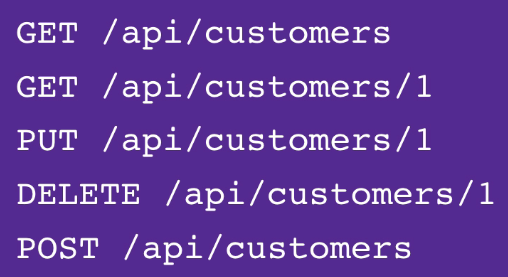
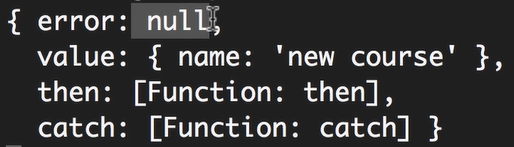

# 4- Building RESTful API's Using Express

- Express - 构建快速轻量级web应用的框架

## 1 - RESTful Services（RESTful API）


服务器把资源作为endpoint开放出去：

http://vidly.com/api/customers

客户端可以向服务器的RESTful API发出http请求进行CRUD操作（增删改查）

- HTTP methods来表示请求的目的
  - GET - 获取数据
  - POST - 创建数据
  - PUT - 更新数据
  - DELETE - 删除数据



## 2 - Introducing Express

- [Express](https://www.npmjs.com/package/express)

环境构建

```powershell
mkdir express-demo && cd express-demo
npm init --yes
npm i express
```

## 3 - Your First Web Server

- [Express API文档](http://expressjs.com/en/4x/api.html)

在express-demo项目中创建index.js

###### #1 导入Express

```javascript
const express = require('express');
const app = express(); // object
```

###### #2 创建路由规则

app对象有方法：get() post() put() delete()

- 参数1：url
- 参数2：回调函数（Route handler）

```javascript
app.get('/', (req, res) => {
    res.send('Hello World!');
});
```

###### #3 端口监听

`port`优先作为环境变量导入

```javascript
const port = process.env.PORT || 3000;
app.listen(port, () => { console.log(`listening on port ${port}...`)});
```

设置环境变量：windows - set / linux - export

```powershell
set PORT=5000
```

###### #4 node监视器

```
npm i -g nodemon
nodemon index.js
```

###### #5 路由参数

```javascript
app.get('/api/courses/:id', (req, res) => {
	res.send(req.params.id);
})
```

- 使用路由参数提供必须的数据或值 - `req.params`
- 使用查询字符串提供可选的值 - `req.query`

如：`localhost:3000/api/posts/2018/1?sortBy=name`

###### #6 处理GET请求

```javascript
const courses = [
	{ id: 1, name: "course1" },
	{ id: 2, name: "course2" },
	{ id: 3, name: "course3" },
];

app.get("/api/courses", (req, res) => {
	res.send(courses);
})

app.get("/api/courses/:id", (req, res) => {
	const course = courses.find(c=>{
		c.id === parseInt(req.params.id)
    });
    id(!course) res.status(404).send("The course with given id was not found!");
    res.send(course);
})
```

###### # 7处理POST请求

```javascript
app.use(express.json());

app.post('/api/courses', (req, res) => {
    const course = {
        id: courses.length + 1,
        name: req.body.name
    };
    courses.push(course);
    res.send(course);
});
```

###### #8 输入验证

- 永远不要相信client输入/发送的内容！

- 输入验证包：joi 

```
npm i joi@13.1.0
```

```javascript
const Joi = require('joi');   // class

app.post('/api/courses', (req, res) => {
    const schema = {
        name: Joi.string().min(3).required(),
	};
    
    const result = Joi.validate(req.body, schema);
    if (result.error) {   // 400 - bad request
        res.status(400).send(result.error.details[0].message);
        return;
	}

    const course = {
        id: courses.length + 1,
        name: req.body.name
    };
    courses.push(course);
    res.send(course);
});
```

- Joi.validate(req.body, schema)返回一个对象：其中error和value仅有一个非空（取决于验证是否通过）



###### #9 Postman

HTTP请求测试

###### #10 处理PUT请求

```javascript
app.put("/api/courses/:id", (req, res) => {
  // Look up the course
  // If not existing, return 404
  const course = courses.find((c) => c.id === parseInt(req.params.id));
  if (!course) {
    req.status(404).send("The course with the given ID was not found");
    return;
  }

  // Validate
  // If invalid, return 400 - Bad request
  const schema = {
    name: Joi.string().min(3).required(),
  };

  const result = Joi.validate(req.body, schema);
  if (result.error) {
    // 400 - bad request
    res.status(400).send(result.error.details[0].message);
    return;
  }

  // Update course
  course.name = req.body.name;
  // Return the updated course
  res.send(course);
});
```

###### #11 代码重构

```javascript
function validateCourse(course) {
  const schema = {
    name: Joi.string().min(3).required(),
  };
  return Joi.validate(course, schema);
}
```

###### #12 处理DELETE请求

```javascript
app.delete("/api/courses/:id", (req, res) => {
  const course = courses.find((c) => c.id === parseInt(req.params.id));
  if (!course)
    return req.status(404).send("The course with the given ID was not found");

  const index = courses.indexOf(course);
  courses.splice(index, 1);

  res.send(course);
});
```

