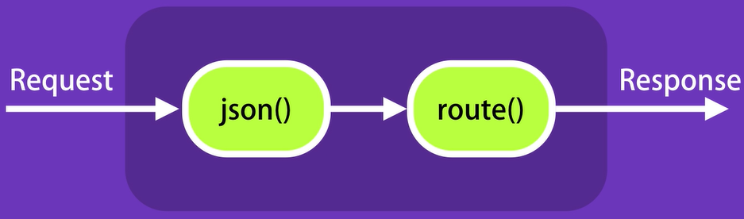
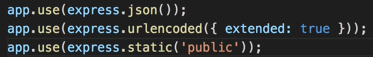
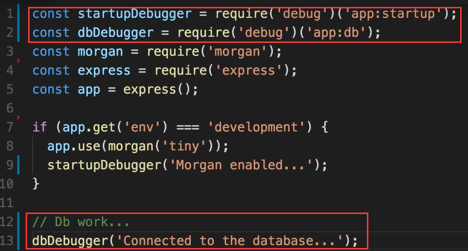
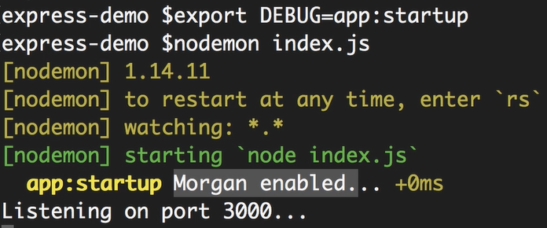
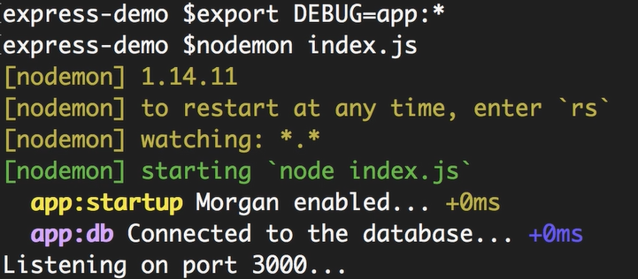
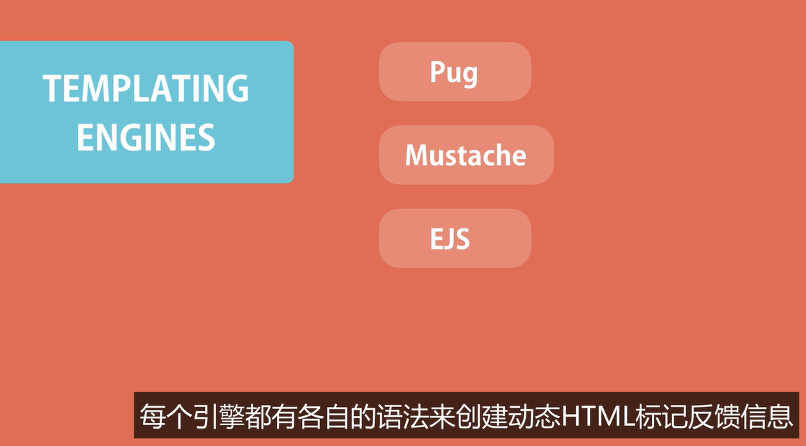
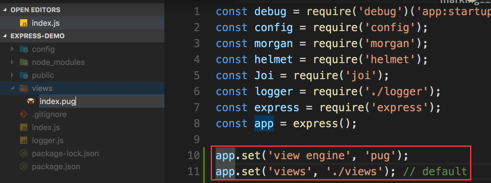
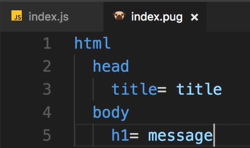
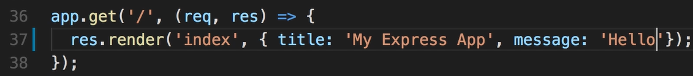
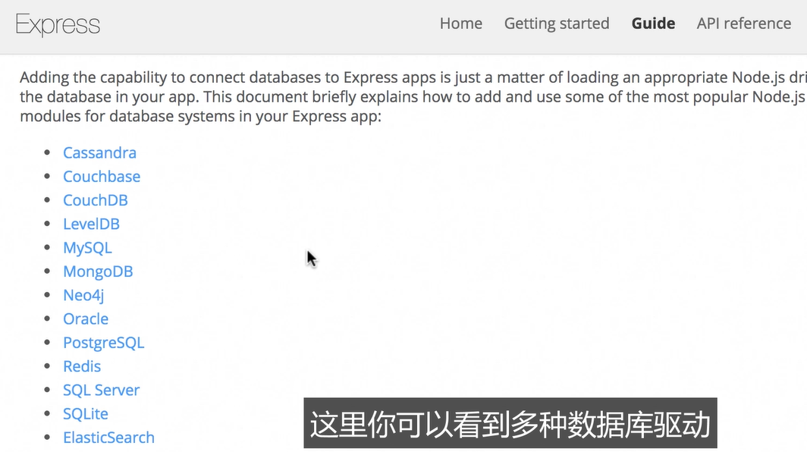

# 5- Express- Advanced Topics

- Middleware
- Configuration
- Debugging
- Templating Engines

## 1 - Middleware

- Middleware function: a function that takes a request object, and either returns a response to the client, or passes control to another middleware function.

- Request Processing Pipeline

  上一节的例子中：

  

- Crosscutting Concerns，可以进行登录、验证、认证等
- Express总体来说就是一堆中间件函数

## 2 - 创建自定义中间件

- 一定要形成Request-Response闭环


next()指传递给下一个中间件函数

## 3 - Express内置中间件



## 4 - 第三方中间件

- [Express middleware (expressjs.com)](http://expressjs.com/en/resources/middleware.html)

如：helmet（http安全）、morgan（日志）

## 5 - 环境

- 开发环境

- 生产环境

只在开发环境中打开morgan 

```
npm i morgan
```

```javascript
const morgan = require('morgan');

// debug
console.log(`NODE_ENV: ${process.env.NODE_ENV}`);
console.log(`app: ${app.get('env')}`);

if (app.get('env') === 'development') {
    app.use(morgan('tiny'));
}
```

需要设置环境变量NODE_ENV，否则就是默认的undefined

## 6 - 配置

- 如何保存应用的设置，并且在不同环境下复写
- 包：config / rc

创建config文件夹，default.json、development.json、production.json

- 密码等不能保存在配置文件中，而应该保存在环境变量中

  - config/custom-environment-variables.json

    


## 7 - Debugging

```
npm i debug
```







取代console.log

## 8 - Templating Engines

- 有时需要向客户端返回HTML，此时要用到模板引擎（创建RESTful后端不需要）



```
npm i pug
```







## 9 - 集成数据库

- 官方参考文档：[Express database integration (expressjs.com)](http://expressjs.com/en/guide/database-integration.html)



## 10 - Authentication

## 11 - Structuring Express App


