# The Ultimate HTML5 & CSS3 Series: Part 1

## Getting Started

工具：

- vs code
  - Prettier - Code formatter
  - Live Server
  - Google chrome

## Web Development Fundamentals

### 1- Introduction

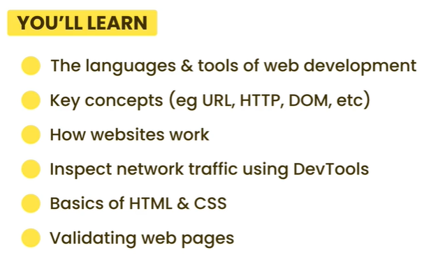

### 2- Languages and Tools of Web Development

- **HTML**

  > Hypertext Markup Language：超文本标记语言
  >
  > 标记语言
  >
  > 负责内容和结构

- **CSS**

  > Cascading Stylesheet：层叠样式表
  >
  > Styling Language
  >
  > 负责样式

- **JavaScript**

  > 编程语言

### 3- How the Web Works

URL - **U**niform **R**esource **L**ocation

RESOURCES:

- Web pages (HTML documents)
- Images
- Video files
- Fonts

DOM - Document Object Model

### 4- Inspecting HTTP Requests and Responses

工具：chrome-开发者工具-Network

访问google.com

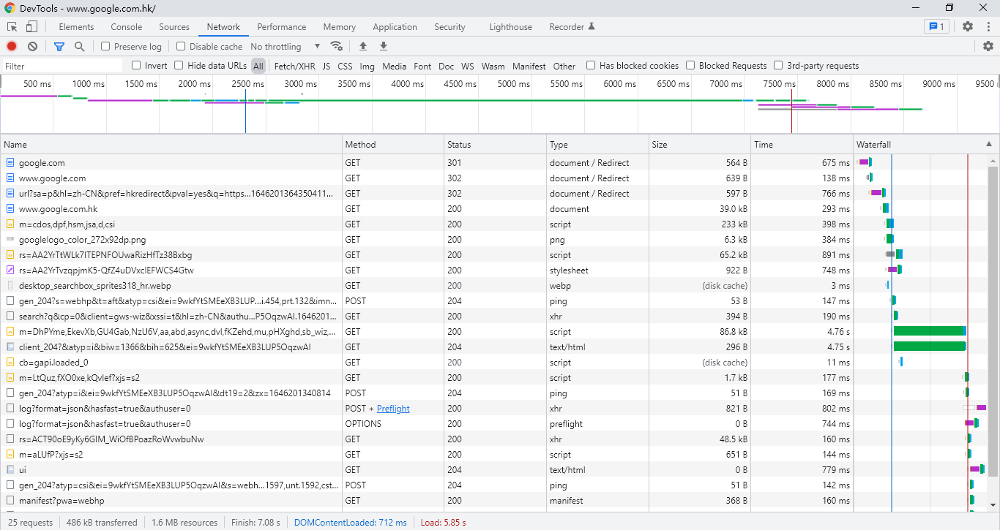

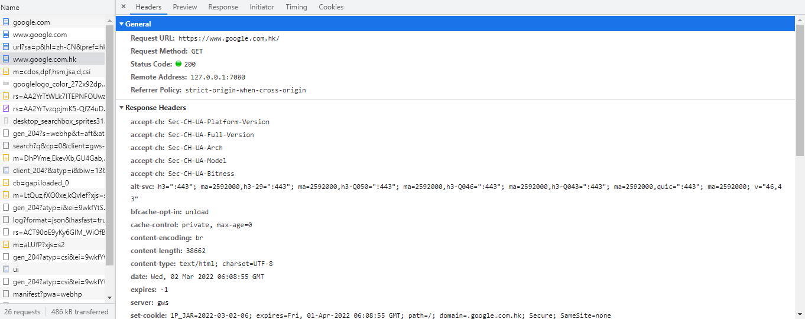

### 5- HTML Basics

```html
<!DOCTYPE html>
<html>
    <head> 
        <title>My first web page</title>
    </head>
    <body>
        
        <p>@Inspiration-Lynn</p>
        <p>learning HTML</p>
    </body>
</html>
```

### 6- CSS Basics

```html
<!DOCTYPE html>
<html>
    <head>
        <title>My first web page</title>
        <style>
            img {
                width: 100px;
                border-radius: 10px;
                float: left;
                margin-right: 10px;
            }
            .username {
                font-weight: bold;
            }
        </style>
    </head>
    <body>
        
        <p class="username">@Inspiration-Lynn</p>
        <p>learning HTML with Mosh!</p>
    </body>
</html>
```

### 7- Formatting Code

Prettier & Format On Save

### 8- Inspecting Pages Using DevTools

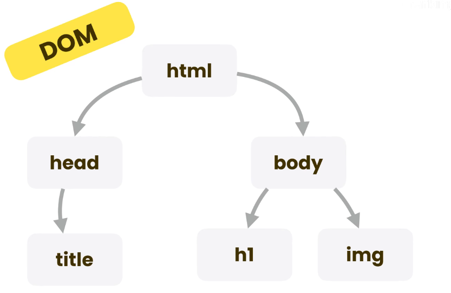

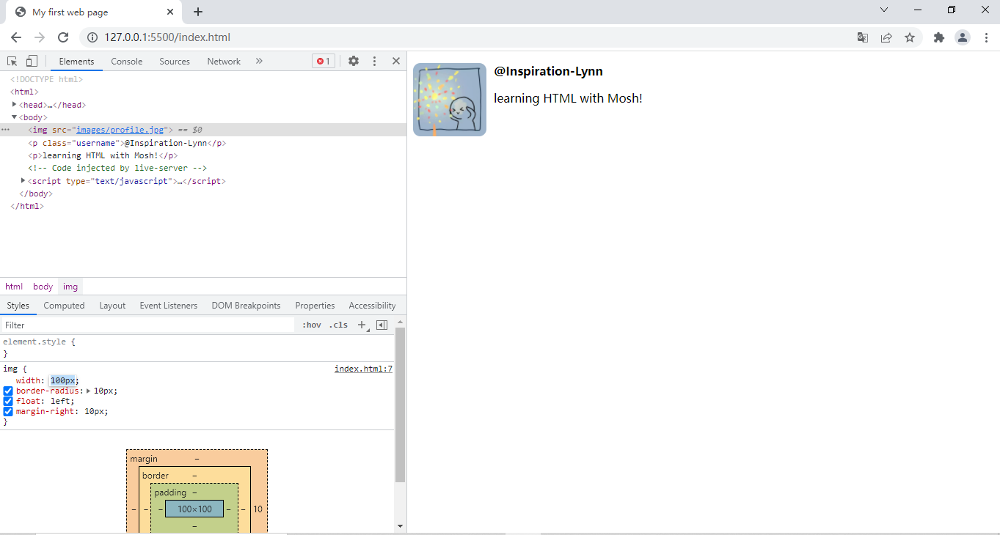


### 9- Validating Web Pages

如果编写的网页不能正常显示，首先进行验证

- 验证html是否有错误：[validator.w3.org](https://validator.w3.org/) 

上传`index.html`

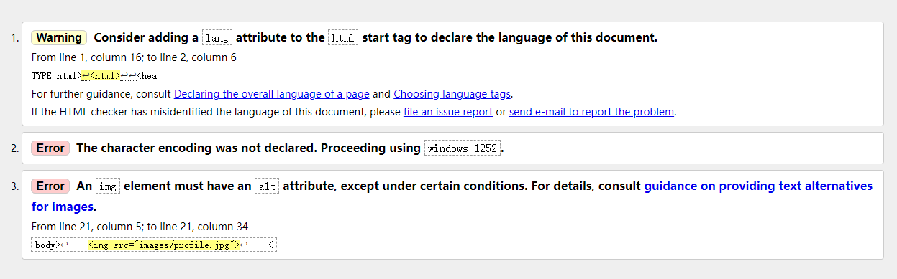

- 验证css是否有错误：https://jigsaw.w3.org/css-validator/

## HTML Basics

### 1 - Introduction

​	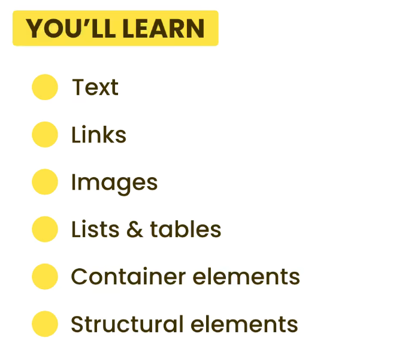

### 2 - The Head Section

- the head section give browser and search engine information about the web page


> tip:  *! + tab* 创建html基础模板

```html
<head>
    <meta charset="UTF-8">
    <meta http-equiv="X-UA-Compatible" content="IE=edge">
    <meta name="viewport" content="width=device-width, initial-scale=1.0">
    <meta name="keywords" content="HTML, CSS">
    <meta name="description" content="learning html and css...">
    <title>Document</title>
</head>
```

### 3 - Text

- 处理文本

> css处理样式

- 标题 - 用于构建文档结构（层次）

一个网页只能有一个一级标题

```html
<body>
    <h1>Heading 1</h1>
    <h2>HTML</h2>
    <p>HTML tutorial</p>
    <h3>code</h3>
    <h3>exercise</h3>
    <h2>CSS</h2>
    <p>CSS tutorial</p>
</body>
```

### 4 - Entities（HTML转义字符）

每个转义字符以`&`开头，以`;`结尾

特定字符：

- < - lt
- \> - gt
- 版权符号 - copy
- 不换行字符 - nbsp

```html
<p>I love to learn &lt;HTML&gt; &copy;</p>
```

### 5 - Hyperlinks

标签`a` - anchor

- 本地网页跳转
- 网页内部跳转
- 外部网站跳转

```html
	<a href="company/about.html">About Me</a>
    <a href="images/profile.jpg" download>my profile</a>
    <a href="#css-section">CSS</a>
    <a href="https://baidu.com" target="_blank">Baidu</a>
    <h2>HTML</h2>
    <p>Lorem ipsum dolor sit amet, consectetur adipisicing elit. Ipsa nobis neque dignissimos libero minima impedit.
        Itaque magni maiores ducimus quod eveniet dignissimos nam accusamus dolor voluptates eligendi libero a maxime
 	</p>
    <h2 id="css-section">CSS</h2>
    <p>Lorem ipsum, dolor sit amet consectetur adipisicing elit. Explicabo officiis voluptatibus, quo, harum est, dicta
        repellat voluptatem at mollitia sit unde assumenda eveniet ab? Architecto maiores inventore, ex optio nobis
    </p>
    <a href="#">Jump to Top</a>
```

### 6 - Images

- 图片网站：[unsplash](https://unsplash.com/t/wallpapers)

CSS调整图片尺寸

```html
<head>
    <style>
        img {
            width: 200px;
            height: 200px;
            object-fit: cover;
        }
    </style>
</head>

<body>
    
</body>
```

在开发者工具中手动调整`object-fit`值，观察区别

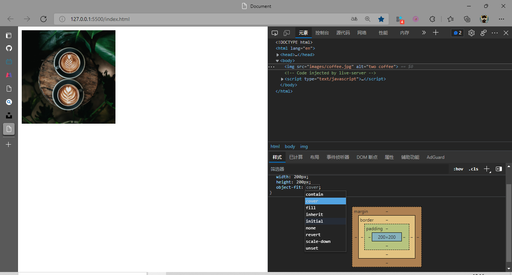

### 7 - Video and Audio

- 图片视频网站：[pexels](https://www.pexels.com/zh-cn/)

HTML中的布尔值属性，如`controls` 、`autoplay` 、 `loop`

- 查看不同浏览器是否支持某种html css特性：[Can I use... Support tables for HTML5, CSS3, etc](https://caniuse.com/)
  - 为不支持的浏览器提供替换文本

```html
<head>
    <style>
        video {
            width: 400px;
        }
    </style>
</head>

<body>
    <video controls src="videos/ocean.mp4">
        Your browser dosen't support videos.
    </video>
</body>
```

### 8 - Lists

嵌套方式创建多级列表

HTML有3种类型的列表：

- 无序列表 - `ul` 

  - 如：导航栏按钮

```html
  <head>
      <style>
          ul {
              list-style: none;
          }
      </style>
  </head>
  
  <body>
      <ul>
          <li>About Me</li>
          <li>Course
              <ul>
                  <li>HTML</li>
                  <li>JavaScript</li>
                  <li>Git</li>
              </ul>
          </li>
          <li>Subscribe</li>
          <li>Contact Me</li>
      </ul>
  </body>
```

- 有序列表 - `ol`
- 描述列表 - `dl`  
  - `dd `用来描述


```html
<body>
    <dl>
        <dt>Title</dt>
        <dd>The Ultimate HTML and CSS Course</dd>
        <dt>Author</dt>
        <dd>Mosh</dd>
        <dt>Skills</dt>
        <dd>HTML</dd>
        <dd>CSS</dd>
        <dd>Responsive Design</dd>
        <dd>Search Engine</dd>
    </dl>
</body>
```

### 9 - Tables

`tr`：table row

`th`：table header

`td`：table data cell

> 注意th和td区别，th居中且加粗

```html
<head>
	<style>
        table,
        td,
        th {
            border: 1px solid grey;
            border-collapse: collapse;
            padding: 5px;
        }

        tfoot {
            text-align: left;
        }
    </style>
</head>

<body>
    <table>
        <thead>
            <tr>
                <th colspan="2">Expenses</th>
            </tr>
            <tr>
                <th>Category</th>
                <th>Amout</th>
            </tr>
        </thead>
        <tbody>
            <tr>
                <td>Marketing</td>
                <td>$100</td>
            </tr>
            <tr>
                <td>Accouting</td>
                <td>$200</td>
            </tr>
        </tbody>
        <tfoot>
            <tr>
                <th>Total</th>
                <th>$300</th>
            </tr>
        </tfoot>
    </table>
</body>
```

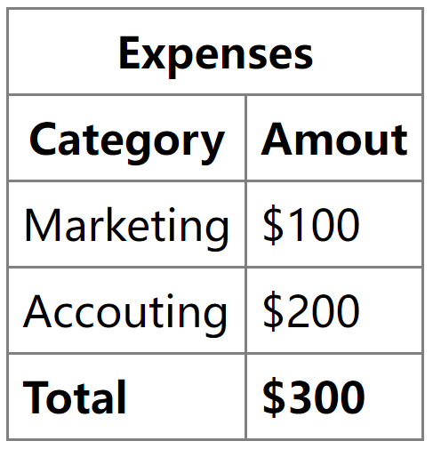

### 10 - Containers

容器元素

通用容器 - Generic

- **`<div>` - Block-level Element块级元素**

  ```html
  <head>	
  	<style>
          .product {
              background-color: gold;
              width: 300px;
          }
      </style>
  </head>
  
  <body>
      <div class="product">
          <p>Lorem ipsum dolor sit amet.</p>
          <a href="#">Link</a>
      </div>
      <div class="product">
          <p>Lorem ipsum dolor sit amet.</p>
          <a href="#">Link</a>
      </div>
  ```

- **`<span>`- Inline Element行内元素**

  - 常用于给文本加样式

  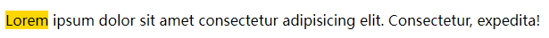

### 11 - Semantic Elements（语义元素）

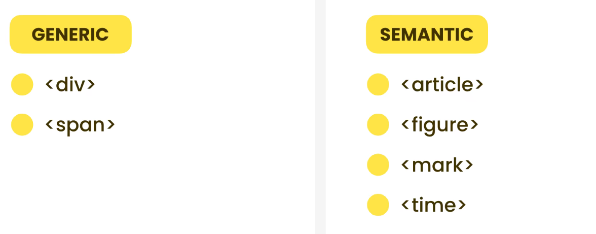

Semantic container：

- `<article>`
  - An independent, self-contained content, eg. Forum post, Comments, Reviews, Product cards
- `<figure>`
- `<mark>`
- `<time>`

```html
<body>
    <article class="article">
        <h1>Heading</h1>
        <p>Published <time datetime="2021-01-01">January 1 2021</time></p>
        <p><mark>Lorem</mark> ipsum dolor sit amet consectetur adipisicing elit. A, voluptate!</p>
        <figure>
            
            <figcaption>My coffee this monrning</figcaption>
        </figure>
    </article>
</body>
```

### 12- Structuring a Web Page

- `<main>` - 网页的主体内容（每个网页仅能有一个）
- `<section>` - 给相关内容分组
- `<header>` - 介绍性内容
- `<footer>`
- `<aside>` - 与主体不直接相关的内容

示例：

```html
<body>
    <header>
        <nav>
            <ul>
                <li></li>
                <li></li>
                <li></li>
            </ul>
        </nav>
    </header>
    <main>
        <section>
            <h2>Product</h2>
            <article></article>
            <article></article>
            <article></article>
        </section>
        <section>
            <h2>Testimonial</h2>
            <article></article>
            <article></article>
        </section>
    </main>
    <aside></aside>
    <footer>
        <nav>
            <ul></ul>
        </nav>
    </footer>
</body>
```

## CSS Basics

### 1- Introduction

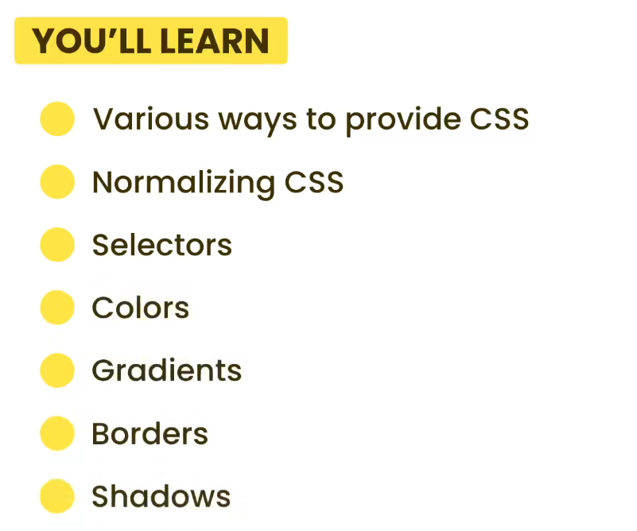

### 2 - Providing CSS

使用CSS的三种方式：

- Embedded stylesheets - 内嵌样式表 （将样式封装在HTML文档中）

  - 扩展性差 - 需要把样式复制到每个单独的网页中
  - 违反 `Separation of Concerns` （关注点分类原则）- 不同模块满足不同关注点
  - 可以覆盖外部样式表中的样式

- External stylesheets - 外部样式表（样式写在外部独立文件中） 

  - `styles.css `

- Inline styles - 行内样式（直接在HTML元素上应用样式）

  - 违反 `Separation of Concerns` （关注点分类原则）

  ```html
  <p style="color: blue; font-weight: bold;">Lorem ipsum dolor sit amet consectetur</p>
  ```

  更好的使一段改变样式的方法：

  ```html
  <head>	
  	<style>
          #first {
              color: blue;
              font-weight: bold;
          }
      </style>
  </head>
  
  <body>
      <p id="first">Lorem ipsum dolor sit amet consectetur</p>
      <p>Lorem ipsum, dolor sit amet consectetur adipisicing elit. Ullam, hic!</p>
  </body>
  ```

### 3 - Normalizing CSS（CSS一致化）

不同浏览器渲染某些html元素可能不同

- 解决工具：[normalize.css](https://necolas.github.io/normalize.css/)
  - 提供默认样式确保不同浏览器渲染结果一致
  - 将`normalize.css`链接另存为到电脑中

链接进`html`：

```html
<link rel="stylesheet" href="css/normalize.css">
```

### 4 - Basic Selectors

select elements for styling porposes:

- Type
- ID 
- Class 
- Attribute

举例：

1. Type

```css
body {
	margin: 10px;
}
```

2. ID & Class

```html
<section id="products">
    <article class="product"></article>
    <article class="product"></article>
    <article class="product"></article>
</section>
```

```css
#products {

}

.product {
    
}
```

区别：ID - 不能有多个元素拥有同一个ID；Class - 多个元素可以共用一个类

3. Attribute - 不常见


```html
<a href="https://google.com" target="_blank">Google</a>
```

```css
a[target] {
    
}
```

```css
a[href^="https"][href$=".com"] {
	color: orange;
}
```

### 5 - Relational Selectors（关系选择器）

1. case 1：作用于全部后代

```html
<section id="products">
        <p>Lorem ipsum dolor sit amet consectetur adipisicing elit.</p>
        <article>
            <p>Lorem ipsum dolor sit amet.</p>
        </article>
    </section>
```
选中products嵌套的所有p标签：
```css
#products p {
    color: orange;
}
```

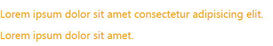

2. case 2：只作用于直接后代

选中products嵌套的一级p标签：

```css
#products > p {
    color: orange;
}
```

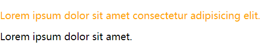

3. case 3：选择同级元素（紧接着的下一个）

```html
<body>
    <section id="products">
        <p>Lorem ipsum dolor sit amet consectetur adipisicing elit.</p>
        <article>
            <p>Lorem ipsum dolor sit amet.</p>
        </article>
    </section>
    <p>Lorem ipsum dolor sit amet.</p>
    <p>Lorem ipsum dolor sit amet.</p>
</body>
```
选中products后面紧跟的一个p标签：
```css
#products + p {
    color: orange;
}
```

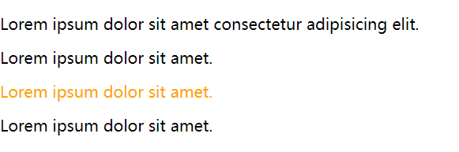

4. case 4：所有同级

选中products后面的所有p标签：

```css
#products ~ p {
    color: orange;
}
```

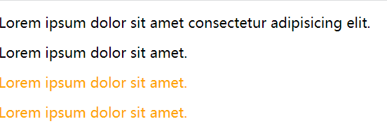

关系选择器总结：

- cleaner markup - 不用声明很多id和class
- 代码比较脆弱 - 取决于这个元素在DOM中的位置（移动元素，规则失效）
- 效率不如基本选择器

### 6 - Pseudo-class Selector（伪类选择器）

伪类是浏览器默认添加的类，伪类以`:`开头

- **first-child、last-child、first-of-type、last-of-type**

`:first-child`表示第一个子元素（`last-child`）

```html
<body>
    <article>
        <p>Lorem ipsum dolor sit amet.</p>
        <p>Lorem ipsum dolor sit amet.</p>
    </article>
</body>
```

```css
article :first-child {
    font-size: 140%;
    font-style: italic;
}
```

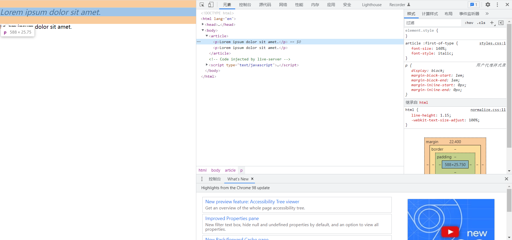

`first-of-type`表示不同类型标签的第一个元素；同理有`last-of-type`

```html
<body>
    <article>
        <h2>Heading</h2>
        <p>Lorem ipsum dolor sit amet.</p>
        <p>Lorem ipsum dolor sit amet.</p>
    </article>
</body>
```

```css
article :first-of-type {
    font-size: 140%;
    font-style: italic;
}
```

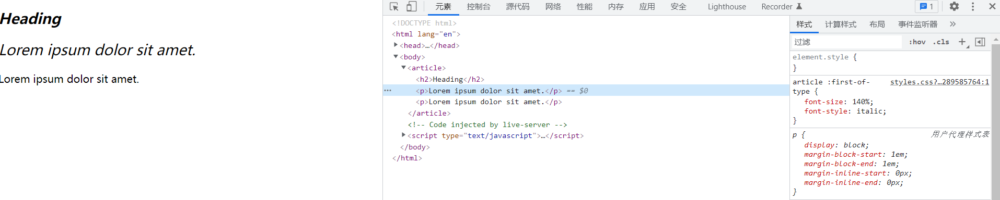

只应用于`p`标签：

```css
article p:first-of-type {
    font-size: 140%;
    font-style: italic;
}

article p:last-of-type {
    font-weight: bold;
}
```

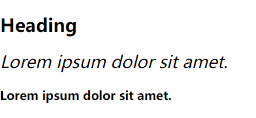

- **nth-child**

奇数行设为粉色

```html
<ul>
    <li>Item 1</li>
    <li>Item 2</li>
    <li>Item 3</li>
    <li>Item 4</li>
    <li>Item 5</li>
</ul>
```

```css
ul li:nth-child(odd) {
    color: deeppink;
}
```

- **链接有关：link(未访问)、visited(访问过)、hover(悬浮)**

```css
a:visited, 
a:link {
    color: dodgerblue;
}

a:hover {
    color:deeppink;
}
```

### 7 - Pseudo-element Selectors（伪元素选择器）

伪元素以`::`开头   

伪类-伪元素区别：

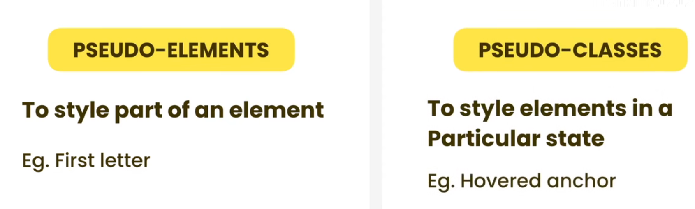

- **first-letter、first-line、selection、before**

以前这么写：

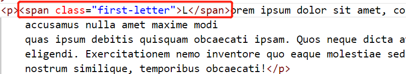

利用伪元素选择器只需修改css文件：

```css
p::first-letter {
    font-size: 140%;
    font-weight: bold;
}
```

综合起来：

```html
<body>
    <p>Lorem ipsum dolor sit amet, consectetur adipisicing elit. Vero, quod ea? Fugiat
        accusamus nulla amet maxime modi
        quas ipsum debitis quisquam obcaecati ipsam. Quos neque dicta at culpa vel rem architecto suscipit commodi
        eligendi. Exercitationem nemo inventore quo eaque molestiae sed, maiores veritatis, aspernatur numquam autem
        nostrum similique, temporibus obcaecati!</p>
</body>
```

```css
p::first-letter {
    font-size: 140%;
    font-weight: bold;
}

p::first-line {
    font-weight: bold;
}

p::selection {
    background-color: pink;
}

p::before {
    content: "...";
    display: block;
}
```

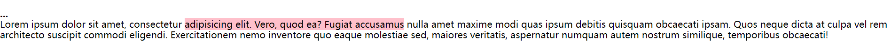

### 8 - Selectors Specificity（选择器优先级）

给定元素应用了不止一种规则

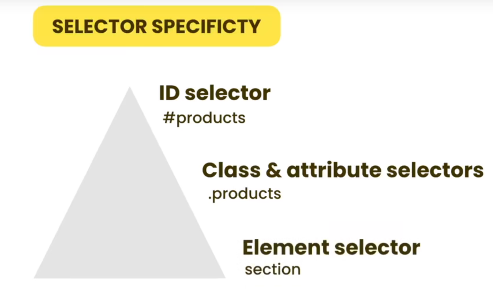

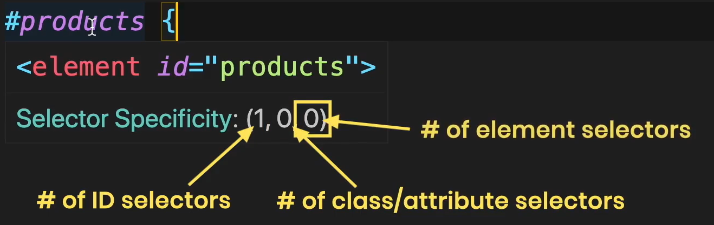

### 9 - Inheriance（继承）

一些css特性从父类继承（一般与文字内容有关的属性都能继承）

### 10 - Colors

取色器 - Google搜索`color picker`

表示颜色的方法：

- 颜色名
- RGB
  - rgb()
  - rgba() 加上透明度设置
- HSL
  - hsl()
  - hsla()
- 十六进制值

### 11 - Gradients（渐变）

```css
background: linear-gradient(dodgeblue, yellow)
```

创建渐变css代码的工具：[gradient generator](https://cssgradient.io/)


### 12 - Borders（边框）

### 13 - Shadows（阴影）

```html
<body>
    <div class="box">
        <h1>Heading</h1>
    </div>
</body>
```

给元素增加阴影：

```css
.box {
    width: 200px;
    height: 200px;
    background: dodgerblue;
    box-shadow: 0 0 30px grey;
}
```

给文字添加阴影：

```css
h1 {
    color: white;
    text-shadow: 3px 3px 5px rgba(0, 0, 0, 0.2);
}
```

