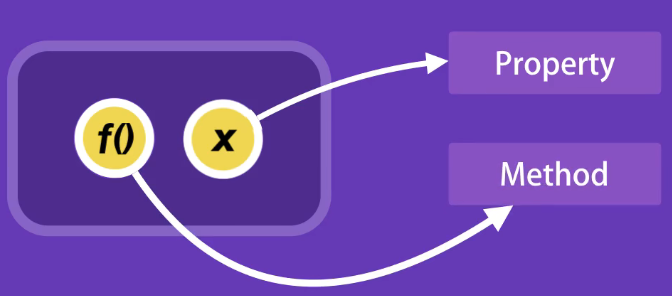
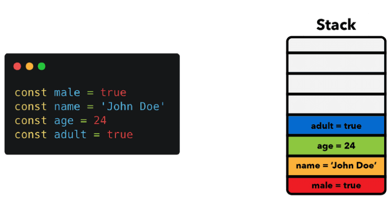

# Object-oriented Programming in JavaScript

## Getting Started

### 1 - What is OOP

A programming **paradigm** centered around **objects** rather than functions.

支持OOP的语言：

- C#
- Cpp
- Java
- Ruby
- Python
- JavaScript

基于OOP设计的框架：

- Angular

### 2 - Four Pillars of OOP

OOP的4个核心概念：

- **Encapsulation - 封装**
  - 组合相关变量和函数 - **减少复杂性**
  - **增加重用性**
- **Abstraction - 抽象**
  - 接口更简单 - **减少复杂性**
  - **隔离代码更改的影响**
- **Inheritance - 继承**
  - **减少冗余代码**
- **Polymorphism - 多态**
  - **摆脱冗长的if/else或switch/case语句**

OOP将一组相关的变量和函数组合成一个单元——对象（object）

封装：



### 3 - 开发环境

- 代码编辑器（vs code）

- web server（vs code 插件: live server）

## Objects

### 1 - Introduction

创建对象的3种方法：

- Object Literals
- Factories
- Constructors

### 2 - Object Literals（对象创建语法）

Js中的对象实际上是一组键值对的集合

```javascript
const circle {
	radius: 1,
 	location: {
		x: 1,
        y: 1
    },
    draw: function() {
		console.log('draw');
    }
}
```

- radius、location为**属性**(Property) - 保存值
- draw为**方法**(Method) - 定义逻辑

访问成员：

```javascript
circle.draw();
```

### 3 - Factories

返回一个对象

当对象具有行为性（有至少一个方法）时，使用工厂函数和构造 函数来创建对象，而不要用对象创建语法。

注意命名：驼峰式

```javascript
// factory function
function createCircle(radius) {
    return {
        radius,
        draw: function () {
            console.log('draw');
        }
    };
}

const circle = createCircle(1);
circle.draw();
```

### 4 - Constructors

使用this来设置对象属性

注意命名

```javascript
// Constructor function
function Circle(radius) {
    this.radiu = radius;
    this.draw = function () {
        console.log('draw');
    }
}

const circle = new Circle(1);
circle.draw();
```

使用`new`操作符，发生了3件事：

1. 创建一个空对象
2. 设置`this`指向这个对象（默认情况下this指向全局对象）
3. 从函数返回对象（自动return this）

### 5 - Constructor Property

每个JS对象都有一个叫做constructor的属性：引用创建这个对象的构造函数

```javascript
let x = {};
```

JS引擎将其转换成：

```javascript
let x = new Object();
```

JS一些内置的constructor:

```javascript
new String();  // '',"",``这些String literal更常用
new Boolean(); // true, flase更常用
```

### 6 - Functions are Objects


### 补充：JS内存管理

> **JavaScript's Memory Management**
>
> 阅读：https://felixgerschau.com/javascript-memory-management/

**Primitive values get stored in the stack**

A stack is a data structure that JavaScript uses to store *static* data. Static data is data where the engine knows the size at compile time. In JavaScript, this includes **primitive values** (*strings*, *numbers*, *booleans*, *undefined*, and *null*) and **references**, which point to objects and functions.



**Objects and functions are stored in heap: Dynamic memory allocation**


**References in JavaScript**

All variables first point to the stack. In case it's a non-primitive value, the stack contains a reference to the object in the heap.


### 补充：JS作用域（JS Scope）

> 参考：[JavaScript Scope (w3schools.com)](https://www.w3schools.com/js/js_scope.asp)

作用域决定了变量的可访问性（可见性）

JS有3种类型的作用域：

- Block scope 
- Function scope
- Global scope

### 7 - Value vs Reference Types

2 categories of types in JS:

- Value Types (Primitives)
  - Number
  - String
  - Boolean
  - Symbol
  - undefined
  - null
- Reference Types
  - Object
  - Function
  - Array

```javascript
let x = {value: 10};
let y = x;

x.value = 20;
```


- Primitives are copied by their value
- Objects are copied by their reference

### 8 - Adding or Removing Properties

动态语言，可以增加、删除属性（Java要实现这种需要修改类）

增加：

```javascript
// .方式
circle.location = { x: 1 };
// []方式，可以动态设置
const propertyName = 'location';
circle[propertyName] = { x: 1 }; 
```

删除：

```javascript
delete circle.location;
```

### 9 - Enumerating Properties

遍历对象属性：

```javascript
for(let key in circle) {
    if (typeof circle[key] != 'function')
		console.log(key, circle[key]);
}
```

得到所有的key（无法区分属性和方法）：

```javascript
// key返回到一个数组中
const keys = Object.keys(circle);
console.log(keys);
```

想知道一个对象中是否有某个属性：

```javascript
if ('radius' in circle)
    console.log('yes');
```

### 10 - Abstraction

背景问题

Hide the details; Show the essential.

### 11 - Private Properties and Methods

利用作用域，设置构造函数内的本地变量（没有this. 外部不可见）

```javascript
function Circle(radius) {
    this.radius = radius;
    
    let defaultLocation = { x: 0. y: 0};
    let computeOptimumLocation = function(factor) {
        //
    }
    
    this.draw = function() {
        let x, y;
        
        computeOptomumLocation(0.1);
        // defaultLocation
        // this.radius 
        
        console.log('draw');
    };
}
```

闭包

### 12 - Getters and Setters

```javascript
function Circle(radius) {
    this.radius = radius;
    
    let defaultLocation = { x: 0. y: 0};
    
    this.draw = function() {
        let x, y;
        console.log('draw');
    };
    
    Object.defineProperty(this, 'defaultLocation', {
        //getter
        get: function() {
            return defaultLocation;
        },
        //setter
        set: function(value) {
            if(!value.x || !value.y)
                throw new Error('Invalid location');
            defaultLocation = value;
        }
    })
}
```

### 14 - Exercise- Stopwatch


### 15- Solution- Stopwatch


## Prototypes


## Prototypical Inheritance


## ES6 Classes

JavaScript是动态类型语言；其Class不同于Java或者Cpp中的类。

JS Class本质更像是配合原型和原型继承的语法糖。


## Modules