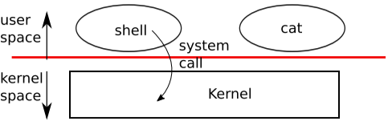
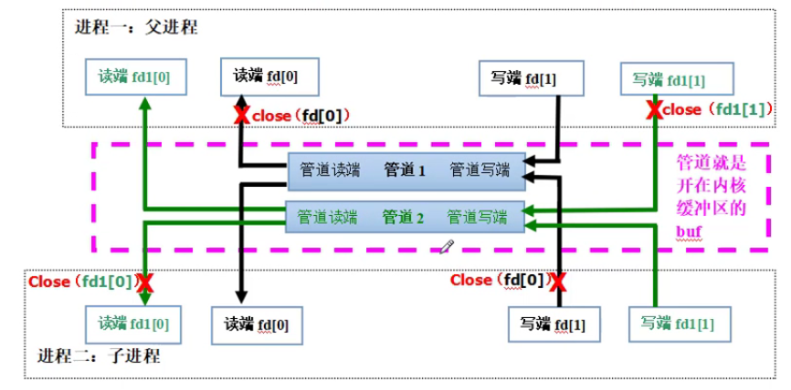
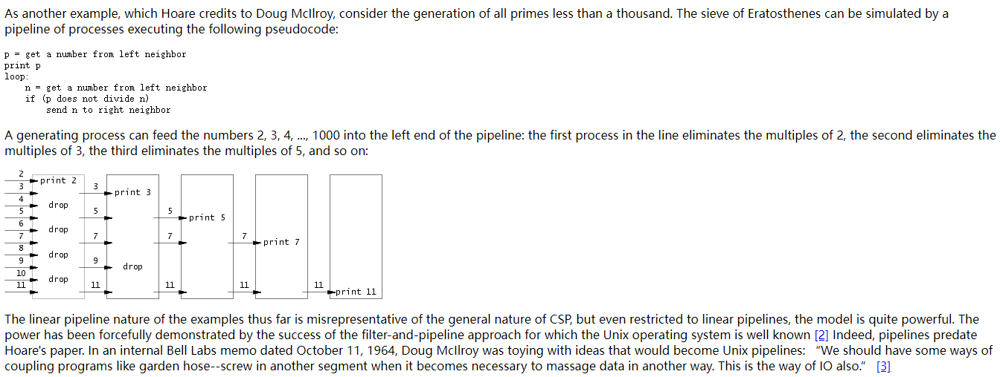

## chapter 1 Operating system interfaces



### 1.1 Processes and memory

##### shell implementation: fork() & exec()

### 1.2 I/O and File descriptors

##### file discriptor features

1. a **small integer** representing a kernel-managed object that a process may read from or write to
2. the file descriptor interface abstracts away the differences between files, pipes, and devices, making them all look like **streams of bytes**.
3. **an index into a per-process table**, every process has a private space of file descriptors starting at zero (0: standard input; 1: standard output; 2: standard error)

##### cat

```c
// 1. system call write() & read() implement cat
char buf[512];
int n;
for(;;) {
	n = read(0, buf, sizeof(buf));
    if (n == 0) break;
    if (n < 0) {
        fprintf(2, "read error\n");
        exit(1);
	}
    if (write(1, buf, n) != n) {
        fprintf(2, "write error\n");
        exit(1);
	}
}
```

##### I/O redirection 

```c
// 2. File descriptors and fork() implement I/O redirection
// redirect
pid = fork();
if (pid == 0) {        // child
    close(1);          // releases file descriptors 1
    // file descriptors 1 allocates to redirect.txt
    open("redirect.txt", O_WRONLY|O_CREATE);  

    char* argv[] = {"echo", "this", "is", "redirect", "echo", 0};
    exec("echo", argv);          // exec preserves file descriptors
    fprintf(2, "redirect failed\n");
    exit(1);
} else {
    wait(&status);
}
```

### 1.3 pipe

##### **pipe features**

- ##### A pipe is a small kernel buffer exposed to processes as a pair of file descriptors, one for reading and one for writing

- 没看懂：P16-p17

```c
// pipetest.c
int p[2];
char *argv[2];
argv[0] = "wc";
argv[1] = 0;
pipe(p);
if (fork() == 0) {
    close(0);
    dup(p[0]);    // make file descriptor zero refer to the read end of the pipe
    close(p[0]);
    close(p[1]);
    exec("wc", argv);
} else {
    close(p[0]);
    write(p[1], "hello world\n", 12);
    close(p[1]);
}
```

##### 	lab1: Xv6 and Unix utilities

​	https://pdos.csail.mit.edu/6.S081/2021/labs/util.html

###### 	lab1-2 pingpong

-  IPC-父子进程双向通信（pipe是单向的）



```c
#include "kernel/types.h"
#include "kernel/stat.h"
#include "user/user.h"

int main()
{
    int pid;
    char *msg = "m";
    int pipefd1[2];   // parent write, child read
    int pipefd2[2];   // child write, parent read

    pipe(pipefd1);
    pipe(pipefd2);
    pid = fork();
    if (pid > 0) {
        close(pipefd1[0]);
        close(pipefd2[1]);
        write(pipefd1[1], msg, sizeof(char));
        read(pipefd2[0], msg, sizeof(char));
        printf("%d: received pong\n", getpid());
        close(pipefd1[1]);
        close(pipefd2[0]);
    } else {
        close(pipefd1[1]);
        close(pipefd2[0]);
        read(pipefd1[0], msg, sizeof(char));
        printf("%d: received ping\n", getpid());
        write(pipefd2[1], msg, sizeof(char));
        close(pipefd1[0]);
        close(pipefd2[1]);
    }
    exit(0);
}
```

###### lab1-3 primes



```c
#include "kernel/types.h"
#include "kernel/stat.h"
#include "user/user.h"
#define UPPER_BOUND 35

int buf[UPPER_BOUND+1];

void initBuf()
{
    for (int i = 2; i <= UPPER_BOUND; i++) {
        buf[i] = i;
    }
}

int primeSieve(int sieve)
{
    int flag = 0;
    int nextSieve;
    printf("prime %d\n", sieve);
    for (int i = sieve+1; i <= UPPER_BOUND; i++) {
        if (buf[i] % sieve == 0) {
            buf[i] = 0;  // drop
        }
        if (flag == 0 && buf[i] % sieve != 0) {
            nextSieve = buf[i];
            flag = 1;
        }
    }
    buf[sieve] = 0;   // 避免重复输出
    // sieve done, ready to output leftover primes
    if (flag == 0) { 
        for (int i = 2; i <= UPPER_BOUND; i++) {
            if (buf[i] != 0)
                printf("prime %d\n", buf[i]);
        }   
        return 0;
    }
    return nextSieve;
}

int main()
{
    int p[2];
    int sieve = 2;
    int nextSieve = 0;

    initBuf();
    nextSieve = primeSieve(sieve);
    while (nextSieve) {     // 一轮循环对应一轮筛
        pipe(p);        
        int pid = fork();
        if (pid == 0) {
            close(p[1]);
            sieve = nextSieve;
            read(p[0], &buf, sizeof(buf));
            close(p[0]);
            nextSieve = primeSieve(sieve);
        } else {
            close(p[0]);
            write(p[1], &buf, sizeof(buf));
            close(p[1]);
            wait(0);
            exit(0);
        }
    }
    exit(0);
}
```

###### lab1-4 find

参考ls.c

```c
#include "kernel/types.h"
#include "kernel/stat.h"
#include "user/user.h"
#include "kernel/fs.h"

char* fmtname(char *path)
{
    char *p;
    // Find first character after last slash.
    for(p=path+strlen(path); p >= path && *p != '/'; p--)
    ;
    p++;
    return p;
}

void find(char* path, char* file)
{
    char buf[512], *p;
    int fd;
    struct dirent de;
    struct stat st;

    if((fd = open(path, 0)) < 0){
        fprintf(2, "ls: cannot open %s\n", path);
        return;
    }
    if(fstat(fd, &st) < 0){
        fprintf(2, "ls: cannot stat %s\n", path);
        close(fd);
        return;
    }
    switch(st.type){
    case T_FILE:
        if (strcmp(fmtname(path), file) == 0) {
            printf("%s\n", path);
        }
        break;
    case T_DIR:
        if(strlen(path) + 1 + DIRSIZ + 1 > sizeof buf){
            printf("ls: path too long\n");
            break;
        }
        strcpy(buf, path);
        p = buf+strlen(buf);
        *p++ = '/';
        while(read(fd, &de, sizeof(de)) == sizeof(de)){
            if(de.inum == 0)
                continue;
            memmove(p, de.name, DIRSIZ);
            p[DIRSIZ] = 0;
            if(stat(buf, &st) < 0){
                printf("ls: cannot stat %s\n", buf);
                continue;
            }
            if ( strcmp(fmtname(buf), ".") != 0 && strcmp(fmtname(buf), "..") != 0) {
                find(buf, file);
            }
        }
        break;
    }
    close(fd);
}

int main(int argc, char* argv[])
{
    if (argc < 2) {
        printf("usage: find (path) file\n");
    } else if (argc == 2) {
        find(".", argv[1]);
    } else if (argc == 3) {
        find(argv[1], argv[2]);
    }

    exit(0);
}
```

###### lab1-5 xargs

暂无思路
