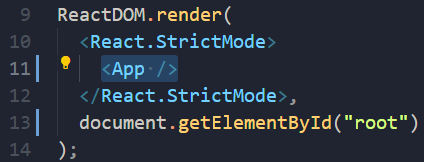
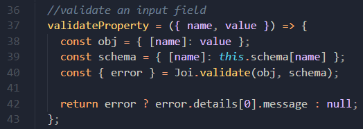
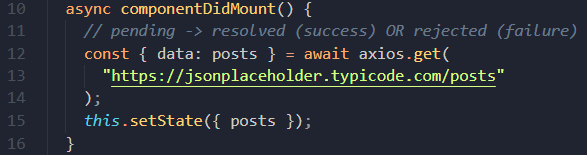

# React

- mosh系列课程-[视频链接](https://www.bilibili.com/video/BV1Sb411P79t?p=3&spm_id_from=pageDriver)

## 1- GettingStarted（28m）

### 1 - 创建开发环境

vs code插件：`Simple React Snippets` `prettier`

配置prettier

### 2 - 第一个React App

环境：Node >= 14.0.0 & npm >= 5.6

```bash
npx create-react-app react-app
```

zero-config setup:

- Development Server
- Webpack
- Babel

启动：

```bash
cd react-app
npm start
```

在本机的3000端口启动程序


### 3 - hello world

删除`src/`下所有文件，新建`index.js`

```javascript
import React from "react"
import ReactDOM from "react-dom"

const element = <h1>Hello World</h1>;
ReactDOM.render(element, document.getElementById("root"));
```

### 4 - 自定义配置

`package.json`

资深开发者：

```powershell
npm run eject
```

### 5 - 全栈架构（Full-stack Architecture）


### 6 - 课程大纲

- Js
- Components
- Tables
- Forms
- Routing
- HTTP Services
- Auth
- Deployment

## 2- ES6 Refresher（48m）

- var、let & const

  - `var`作用域为function

  - `let`、`const`作用域为定义它的代码块 ✔

- Objects：一组键值对

- `this`

  this的值取决于函数是怎样被调用的

  ```js
  const person = {
  	name: "Mosh",
  	walk() {
  		console.log(this);
  	}
  };
  
  person.walk();
  
  const walk = person.walk;
  walk();    // undefined
  ```

  - 使用对象形式调用方法：`this`**always returns a referrence to the current object**
  - 使用单独的函数or对象外的函数：`this` 返回全局对象(浏览器中是windows对象，严格模式则被设置为未定义)

-   绑定`this`

  - 目标：设置为无论何时，this都指向对象本身
  - js中函数也是对象

  ```javascript
  const walk = person.walk.bind(person);
  walk();    
  ```

- Arrow Functions

```javascript
const square = function(number) {
	return number * number;
}
const square = number => number * numer;
```

箭头函数有用的地方：

```javascript
// filter jobs, where job is active
const jobs = [
    { id: 1, isActive: true },
    { id: 2, isActive: true },
    { id: 3, isActive: false }
];

const activeJobs = jobs.filter(job => job.isActive);
console.log(activeJobs);
```

- Arrow Functions and this

箭头函数不会重新绑定`this`

```javascript
const person = {
	talk() {
		setTimeout(() => {
			console.log("this", this), 1000);
		}
	}
};
```

- Array.map()

  当要渲染列表时，要使用Array.map()

```javascript
const colors = ['red', 'green', 'blue'];
const items = colors.map(color => `<li>${color}</li>`);
```

- Object Destructuring

```javascript
const address = {
	street: '';
	city: '';
	country: ''
};

const { street, city, country } = address;
const { street: st } = address;
```

- Spread Operator
  - 合并数组、对象
  - 克隆数组、对象

```javascript
const first = [1, 2, 3];
const second = [4, 5, 6];
const combined = [...first, ...second];
const combined_a = [...first, 'a', ...second];

const first = { name: 'Mosh' };
const second = { job: 'Instructor' };
const combined = {...first, ...second, location: 'Australia'};
```

- Classes

```javascript
class Person {
	constructor(name) {
		this.name = name;
	}
	walk() {
		console.log("walk");
	}
}

const person = new Person("Lynn");
```

- Inheritance

```javascript
class Person {
	constructor(name) {
		this.name = name;
	}
	walk() {
		console.log("walk");
	}
}

class Teacher extends Person {
    constructor(name, degree) {
        super(name);
        this.degree = degree;
    }
    
	teach() {
		console.log("teach");
	}
}

const teacher = new Teacher("Mosh", "MSc");
```

- Modules
  - 模块化上一个应用——分成多个文件
  - 模块内定义的对象默认是私有的，需要导出，外部才可以访问

```javascript
export class Person {
	constructor(name) {
		this.name = name;
	}
	walk() {
		console.log("walk");
	}
}
```

```javascript
import { Person } from './person';

export class Teacher extends Person {
    constructor(name, degree) {
        super(name);
        this.degree = degree;
    }
    
	teach() {
		console.log("teach");
	}
}
```

```javascript
import { Teacher } from "./Teacher";

const teacher = new Teacher("Mosh", "MSc");
teacher.teach();
```

- Named and Default Exports
  - Named Exports: `import { ... } from ''` 
  - Default Exports: `import ... from ''`
  - 可以一起用，如`import React, { Component } from 'react';`

## 3- Components（组件）

### 1 - Introduction

本章目标：


### 2 - Setting Up the Project

```powershell
npx create-react-app counter-app
```

1.  安装bootstrap

```
npm i bootstrap@4.1.1
```

2. 在index.js中引入：

```javascript
import 'bootstrap/dist/css/bootstrap.css'
```

### 3 - 第一个React组件

在`src`下创建文件夹`components`，增加新文件`counter.jsx`

```jsx
import React, { Component } from 'react';

class Counter extends Component {
    render() {
        return <h1>Hello World</h1>;
    }
}

export default Counter;
```

在`index.js`中导入`Counter`类，修改render对象为`Counter`

### 4 - Specifying Children

```jsx
class Counter extends Component {
    render() {
        return <div><h1>Hello World</h1><button>Increment</button></div>;
    }
}
```

or

```jsx
class Counter extends Component {
    render() {
        return <React.Fragment><h1>Hello World</h1><button>Increment</button></React.Fragment>;
    }
}
```

### 5 - Embedding Expressions（嵌入表达式）

不硬编码，动态显示值

`state`包含这个组件所需的数据

```jsx
class Counter extends Component {
    state = {
        count: 1
    };

    render() {
        return <React.Fragment><span>{this.state.count}</span><button>Increment</button></React.Fragment>;
    }
}
```

jsx表达式就像js对象一样

```jsx
class Counter extends Component {
    state = {
        count: 0
    };

    render() {
        return <React.Fragment><span>{this.formatCount()}</span><button>Increment</button></React.Fragment>;
    }

    formatCount() {
        const { count } = this.state;
        return count === 0 ? "Zero" : count;
    }
}
```

### 6 - Setting Attributes

给元素设置属性

```jsx
styles = {
    fontSize: 5,
    fontWeight: "bold",
  };

  render() {
    return (
      <div>
        <span style={this.styles} className="badge badge-primary m-2">
          {this.formatCount()}
        </span>
        <button className="btn btn-secondary btn-sm">Increment</button>
      </div>
    );
  }
```

### 7 - Rendering Classes Dynamically

```jsx
import React, { Component } from "react";

class Counter extends Component {
  state = {
    count: 0,
  };

  render() {
    return (
      <div>
        <span className={this.getBadgeClasses()}>{this.formatCount()}</span>
        <button className="btn btn-secondary btn-sm">Increment</button>
      </div>
    );
  }

  getBadgeClasses() {
    let classes = "badge m-2 badge-";
    classes += this.state.count === 0 ? "warning" : "primary";
    return classes;
  }

  formatCount() {
    const { count } = this.state;
    return count === 0 ? <span>Zero</span> : count;
  }
}

export default Counter;
```

### 8 - Rendering Lists

学习如何渲染一个列表

```jsx
class Counter extends Component {
  state = {
    count: 0,
    tags: ["tag1", "tag2", "tag3"],
  };

  render() {
    return (
      <div>
        <span className={this.getBadgeClasses()}>{this.formatCount()}</span>
        <button className="btn btn-secondary btn-sm">Increment</button>
        <ul>
          {this.state.tags.map((tag) => (
            <li id={tag}>{tag}</li>
          ))}
        </ul>
      </div>
    );
  }
}
```

### 9 - Conditional Rendering

目标：如果数组列表至少有一个项就渲染，如果没有就输出“没有任何标签”

- jsx中没有if语句，因此要回到js层面

方式一：

```jsx
class Counter extends Component {
  state = {
    count: 0,
    tags: [],
  };

  renderTags() {
    if (this.state.tags.length === 0) return <p>there is no tags!</p>;

    return (
      <ul>
        {this.state.tags.map((tag) => (
          <li id={tag}>{tag}</li>
        ))}
      </ul>
    );
  }

  render() {
    return <div>{this.renderTags()}</div>;
  }
}
```

方式二：

- js不同于其他语言，逻辑符号&&可以连接非布尔值（js类真值、类假值）

```jsx
render() {
    return (
      <div>{this.state.tags.length === 0 && <p>please create a tag</p>}</div>
    );
  }
```

### 10 - Handling Events

- 所有react元素都有基于dom事件的属性，如button有onClick属性

```jsx
import React, { Component } from "react";

class Counter extends Component {
  state = {
    count: 0,
  };

  handleIncrement() {
    console.log("Increment Clicked");
  }

  render() {
    return (
      <div>
        <span className={this.getBadgeClasses()}>{this.formatCount()}</span>
        <button
          onClick={this.handleIncrement}
          className="btn btn-secondary btn-sm"
        >
          Increment
        </button>
      </div>
    );
  }

  getBadgeClasses() {
    let classes = "badge m-2 badge-";
    classes += this.state.count === 0 ? "warning" : "primary";
    return classes;
  }

  formatCount() {
    const { count } = this.state;
    return count === 0 ? <span>Zero</span> : count;
  }
}

export default Counter;
```

handleIncrement()函数内部无法访问this（未定义）

obj.method()和function()中this的区别

### 11 - Binding Events Handlers

解决方法一（手动绑定）：js对象有bind方法，返回该对象的新实例，可以设置this指向counter对象

```jsx
class Counter extends Component {
  state = {
    count: 0,
  };

  constructor() {
    super();
    this.handleIncrement = this.handleIncrement.bind(this);
  }

  handleIncrement() {
    console.log("Increment Clicked", this);
  }

  render() {
    return (
      <div>
        <span className={this.getBadgeClasses()}>{this.formatCount()}</span>
        <button
          onClick={this.handleIncrement}
          className="btn btn-secondary btn-sm"
        >
          Increment
        </button>
      </div>
    );
  }
```

点击按钮，成功输出counter对象

解决方法二：箭头函数（不会重新绑定this，而是继承this）

```jsx
handleIncrement = () => {
    console.log("Increment Clicked", this);
};
```

### 12 - Updating the State

- setState()

```jsx
handleIncrement = () => {
    this.setState({ count: this.state.count + 1 });
};
```

### 13 - What Happens When State Changes

### 14 - Passing Event Arguments

箭头函数

```jsx
handleIncrement = (product) => {
    console.log("product:", product);
    this.setState({ count: this.state.count + 1 });
  };

<button
          onClick={() => this.handleIncrement(product)}
          className="btn btn-secondary btn-sm"
        >
          Increment
        </button>
```

### 15 - Setting Up the Vidly Project

```powershell
npx create-react-app vidly
```

安装两个库：`Bootstrap` `font awesome`

```powershell
cd vidly
npm i bootstrap@4.1.1 font-awesome@4.7.0
npm start
```

访问[getbootstrap.com](https://getbootstrap.com/)，在Examples目录找一个简单的模板，打开Framework-Starter template，查看网页源代码，注意body标签的部分

### 16 - Exercises

目标：


### 17 - Building the Movies Component

index.js加上：

```javascript
import "bootstrap/dist/css/bootstrap.css";
import "font-awesome/css/font-awesome.css";
```

App.js：

```javascript
import React, { Component } from "react";
import "./App.css";
import Movies from "./components/movie";

class App extends Component {
  render() {
    return (
      <main className="container">
        <Movies />
      </main>
    );
  }
}

export default App;
```

movie.jsx：

```jsx
import React, { Component } from "react";
import { getMovies } from "../services/fakeMovieService";

class Movies extends Component {
  state = {
    movies: getMovies(),
  };

  handleDelete = (movie) => {};

  render() {
    return (
      <table className="table">
        <thead>
          <tr>
            <th>Title</th>
            <th>Genre</th>
            <th>Stock</th>
            <th>Rate</th>
          </tr>
        </thead>
        <tbody>
          {this.state.movies.map((movie) => (
            <tr>
              <td>{movie.title}</td>
              <td>{movie.genre.name}</td>
              <td>{movie.numberInStock}</td>
              <td>{movie.dailyRentalRate}</td>
            </tr>
          ))}
        </tbody>
      </table>
    );
  }
}

export default Movies;
```

效果：


### 18 - Deleting a Movie

 movies.jsx：

```jsx
import React, { Component } from "react";
import { getMovies, deleteMovie } from "../services/fakeMovieService";

class Movies extends Component {
  state = {
    movies: getMovies(),
  };

  handleDelete = (movie) => {
    const movies = this.state.movies.filter((m) => m._id !== movie._id);
    this.setState({ movies });
  };

  render() {
    return (
      <table className="table">
        <thead>
          <tr>
            <th>Title</th>
            <th>Genre</th>
            <th>Stock</th>
            <th>Rate</th>
            <th></th>
          </tr>
        </thead>
        <tbody>
          {this.state.movies.map((movie) => (
            <tr key={movie._id}>
              <td>{movie.title}</td>
              <td>{movie.genre.name}</td>
              <td>{movie.numberInStock}</td>
              <td>{movie.dailyRentalRate}</td>
              <td>
                <button
                  onClick={() => this.handleDelete(movie)}
                  className="btn btn-danger btn-sm"
                >
                  Delete
                </button>
              </td>
            </tr>
          ))}
        </tbody>
      </table>
    );
  }
}

export default Movies;
```

### 19 - Conditional Rendering

 movies.jsx：

```jsx
import React, { Component } from "react";
import { getMovies } from "../services/fakeMovieService";

class Movies extends Component {
  state = {
    movies: getMovies(),
  };

  handleDelete = (movie) => {
    const movies = this.state.movies.filter((m) => m._id !== movie._id);
    this.setState({ movies });
  };

  render() {
    const { length: count } = this.state.movies;

    if (count === 0) return <p>There is no movies in the database.</p>;

    return (
      <React.Fragment>
        <p>Showing {count} movies in the database.</p>
        <table className="table">
          <thead>
            <tr>
              <th>Title</th>
              <th>Genre</th>
              <th>Stock</th>
              <th>Rate</th>
              <th></th>
            </tr>
          </thead>
          <tbody>
            {this.state.movies.map((movie) => (
              <tr key={movie._id}>
                <td>{movie.title}</td>
                <td>{movie.genre.name}</td>
                <td>{movie.numberInStock}</td>
                <td>{movie.dailyRentalRate}</td>
                <td>
                  <button
                    onClick={() => this.handleDelete(movie)}
                    className="btn btn-danger btn-sm"
                  >
                    Delete
                  </button>
                </td>
              </tr>
            ))}
          </tbody>
        </table>
      </React.Fragment>
    );
  }
}

export default Movies;
```

index.css加上：

```css
padding: 20px 0 0 0;
```

效果：


## 4- Composing Components（01:19）

### 1 - Introduction


### 2 - Composing Components

项目`counter-app`

counters.jsx:

```jsx
import React, { Component } from "react";
import Counter from "./counter";

class Counters extends Component {
  state = {
    counters: [
      { id: 1, value: 0 },
      { id: 2, value: 0 },
      { id: 3, value: 0 },
      { id: 4, value: 0 },
    ],
  };
  render() {
    return (
      <div>
        {this.state.counters.map((counter) => (
          <Counter key={counter.id}></Counter>
        ))}
      </div>
    );
  }
}

export default Counters;
```

### 3 - Passing Data to Components

- props属性

counters.jsx:

```jsx
render() {
    return (
      <div>
        {this.state.counters.map((counter) => (
          <Counter key={counter.id} value={counter.value} selected={true} />
        ))}
      </div>
    );
  }
```

counter.jsx:

```jsx
state = {
    value: this.props.value,
  };
```

### 4 - Passing Children

- children是props的一个属性，开闭标签之间的是children

counters.jsx

```jsx
<Counter key={counter.id} value={counter.value} selected={true}>
            <h4>Title #{counter.id}</h4>
          </Counter>
```

### 5 - Debugging React Apps

- 工具：chrome插件-React Developer Tools

$r

### 6 - Prop vs State

区别：

- props: include data that **input** to the component（只读的）
- state: include data that are local or private to the component（其他组件不能访问这个组件的state，只能在组件内被访问）

### 7 - Raising and Handling Events

counter中添加删除按钮

- The components that **owns** a piece of the state, should be the one **modifying** it.

counter组件发起一个事件onDelete，父组件Counters处理这个事件handleDelete()


counters.jsx添加：

```jsx
handleDelete = () => {
    console.log("Delete handler called");
  };
```


counter.jsx添加：


### 8 - Updating the State

counter.jsx:

```jsx
import React, { Component } from "react";

class Counter extends Component {
  state = {
    value: this.props.counter.value,
  };

  handleIncrement = () => {
    this.setState({ value: this.state.value + 1 });
  };

  render() {
    return (
      <div>
        <span className={this.getBadgeClasses()}>{this.formatCount()}</span>
        <button
          onClick={() => this.handleIncrement()}
          className="btn btn-secondary btn-sm"
        >
          Increment
        </button>
        <button
          onClick={() => this.props.onDelete(this.props.counter.id)}
          className="btn btn-danger btn-sm m-2"
        >
          Delete
        </button>
      </div>
    );
  }

  getBadgeClasses() {
    let classes = "badge m-2 badge-";
    classes += this.state.value === 0 ? "warning" : "primary";
    return classes;
  }

  formatCount() {
    const { value: count } = this.state;
    return count === 0 ? <span>Zero</span> : count;
  }
}

export default Counter;
```

counters.jsx:

```jsx
import React, { Component } from "react";
import Counter from "./counter";

class Counters extends Component {
  state = {
    counters: [
      { id: 1, value: 4 },
      { id: 2, value: 0 },
      { id: 3, value: 0 },
      { id: 4, value: 0 },
    ],
  };

  handleDelete = (counterID) => {
    console.log("handleDelete called", counterID);
    const counters = this.state.counters.filter((m) => m.id !== counterID);
    this.setState({ counters });
  };

  render() {
    return (
      <div>
        {this.state.counters.map((counter) => (
          <Counter
            key={counter.id}
            onDelete={this.handleDelete}
            counter={counter}
          />
        ))}
      </div>
    );
  }
}

export default Counters;
```

### 9 - Single Source od Truth

每个组件都有自己的state,counters组件有一个counter对象数组，counter组件有一个value,这个value值没有和counters里面的保持一致（`value: this.props.counter.value`，这句代码只在counter组件被实例化的时候调用了一次）

解决：删掉counter组件中的本地state，建立唯一数据源


### 10 - Removing the Local State

- 被控组件（controlled component）: 没有自己的本地state，所有数据来自props（完全被父组件控制）

  - **use props to display data & notify changes**

  

counter.jsx:

删除state，替换所有this.state

```jsx
import React, { Component } from "react";

class Counter extends Component {
  render() {
    return (
      <div>
        <span className={this.getBadgeClasses()}>{this.formatCount()}</span>
        <button
          onClick={() => this.props.onIncrement(this.props.counter)}
          className="btn btn-secondary btn-sm"
        >
          Increment
        </button>
        <button
          onClick={() => this.props.onDelete(this.props.counter.id)}
          className="btn btn-danger btn-sm m-2"
        >
          Delete
        </button>
      </div>
    );
  }

  getBadgeClasses() {
    let classes = "badge m-2 badge-";
    classes += this.props.counter.value === 0 ? "warning" : "primary";
    return classes;
  }

  formatCount() {
    const { value } = this.props.counter;
    return value === 0 ? "Zero" : value;
  }
}

export default Counter;
```

counters.jsx:

```jsx
import React, { Component } from "react";
import Counter from "./counter";

class Counters extends Component {
  state = {
    counters: [
      { id: 1, value: 4 },
      { id: 2, value: 0 },
      { id: 3, value: 0 },
      { id: 4, value: 0 },
    ],
  };

  handleReset = () => {
    const counters = this.state.counters.map((c) => {
      c.value = 0;
      return c;
    });
    this.setState({ counters });
  };

  handleIncrement = (counter) => {
    const counters = [...this.state.counters];
    const index = counters.indexOf(counter);
    counters[index].value++;
    this.setState({ counters });
  };

  handleDelete = (counterID) => {
    const counters = this.state.counters.filter((m) => m.id !== counterID);
    this.setState({ counters });
  };

  render() {
    return (
      <div>
        <button onClick={this.handleReset} className="btn btn-primary m-2">
          Reset
        </button>
        {this.state.counters.map((counter) => (
          <Counter
            key={counter.id}
            onDelete={this.handleDelete}
            onIncrement={this.handleIncrement}
            counter={counter}
          />
        ))}
      </div>
    );
  }
}

export default Counters;
```

### 11 - Multiple Components in Sync

增加导航栏

原来组件结构：


修改组件结构：


index.js将root组件修改回`App`:



App.js中用一个基本的bootstrap模板替代默认模板：

[Navbar-bootstrap资源](https://getbootstrap.com/docs/5.1/components/navbar/)

navbar.jsx加上：

```jsx
<nav class="navbar navbar-light bg-light">
        <a class="navbar-brand" href="#">
          Navbar
        </a>
      </nav>
```

如何在导航栏Navbar显示counter的数量？

- 当两个组件是上下层的关系时可以共享、同步数据
- 此处Counters、Navbar非上下层关系
- 两个组件没有上下父子级别的关系时想要共享、同步数据 => 数据上移


### 12 - Lifting the State Up

1. 将state和操作state的所有方法移动到App组件中

2. Counters的props对象中设置Event-`onReset`、`onDelete`、`onIncrement`; 
   1. 在Counters组件中不处理事件，而是将事件冒泡给父组件App

3. counters[]数据源修改 
4. 在导航栏显示总计数

App.js:

```jsx
import React, { Component } from "react";
import "./App.css";
import Navbar from "./components/navbar";
import Counters from "./components/counters";

class App extends Component {
  state = {
    counters: [
      { id: 1, value: 4 },
      { id: 2, value: 0 },
      { id: 3, value: 0 },
      { id: 4, value: 0 },
    ],
  };

  handleReset = () => {
    const counters = this.state.counters.map((c) => {
      c.value = 0;
      return c;
    });
    this.setState({ counters });
  };

  handleIncrement = (counter) => {
    const counters = [...this.state.counters];
    const index = counters.indexOf(counter);
    counters[index].value++;
    this.setState({ counters });
  };

  handleDelete = (counterID) => {
    const counters = this.state.counters.filter((m) => m.id !== counterID);
    this.setState({ counters });
  };

  render() {
    return (
      <React.Fragment>
        <Navbar
          totalCounters={this.state.counters.filter((c) => c.value > 0).length}
        />
        <main className="container">
          <Counters
            counters={this.state.counters}
            onReset={this.handleReset}
            onIncrement={this.handleIncrement}
            onDelete={this.handleDelete}
          />
        </main>
      </React.Fragment>
    );
  }
}

export default App;
```

counters.jsx:

```jsx
import React, { Component } from "react";
import Counter from "./counter";

class Counters extends Component {
  render() {
    return (
      <div>
        <button onClick={this.props.onReset} className="btn btn-primary m-2">
          Reset
        </button>
        {this.props.counters.map((counter) => (
          <Counter
            key={counter.id}
            onDelete={this.props.onDelete}
            onIncrement={this.props.onIncrement}
            counter={counter}
          />
        ))}
      </div>
    );
  }
}

export default Counters;
```

navbar.jsx:

```jsx
import React, { Component } from "react";

class Navbar extends Component {
  state = {};
  render() {
    return (
      <nav class="navbar navbar-light bg-light">
        <a class="navbar-brand" href="#">
          Navbar
          <span className="badge badge-pill badge-secondary">
            {this.props.totalCounters}
          </span>
        </a>
      </nav>
    );
  }
}

export default Navbar;
```

### 13 - Stateless Functional Components

- 像组件Navbar，只有一个返回函数render()，也没有state，只从props获取数据
- 可以将这类组件转换为Stateless Functional Components（不使用类定义这个组件，而使用函数）

快捷键：sfc

```jsx
const Navbar = (props) => {
  return (
    <nav class="navbar navbar-light bg-light">
      <a class="navbar-brand" href="#">
        Navbar
        <span className="badge badge-pill badge-secondary">
          {props.totalCounters}
        </span>
      </a>
    </nav>
  );
};
```

### 14 - Destructuring Arguments

```jsx
const { onReset, counters, onIncrement, onDelete } = this.props;
```

------

### 15 - Lifecycle Hooks

一些可以加入到组件的特殊方法（Lifecycle Hooks），react会自动在不同阶段调用这些方法 

组件在生命周期经历的阶段：

1. MOUNT - 创建组件示例并插入到DOM


2. UPDATE - 组件的state或props改变时发生


3. UNMOUNT - 组件被从DOM中移出，如删除


### 16 - Mounting Phase

1. constructor: 仅在实例化的时候调用一次，常用于将props中的外部数据赋给state

```jsx
constructor(props) {
	super(props);
    console.log("App - Constructor");
	this.state = props.something;
}
```

2. render
3. componentDidMount: 这个钩子在组件被加入DOM后调用，perfect place to make AJAX called to get data from the server

### 17 - Updating Phase

1. render

2. componentDidUpdate - 组件被更新后调用（常用于当有变化时，通过AJAX请求重新向服务器请求数据）

   ```jsx
   componentDidUpdate(preProps, prevState) {
   	console.log('preProps', preProps);
   	console.log('prevState', prevState);
       if(preProps.counter.value != this.props.counter.value) 	{
           // Ajax call and get new data from the server
   	}
   }
   ```

### 18 - Unmounting Phase

componentWillUnmount - 组件被移除之前做一些清理工作，如计时器、监听器、内存优化

```jsx
componentWillUnmount() {
	console.log("counter - Unmount")
}
```

------

### 19 - Excercise - Decrement Button

[Bootstrap-Gridlayout](https://getbootstrap.com/docs/5.1/layout/grid/#example)

### 20 - Solution - Decrement Button

### 21 - Exercise - Like Component

vidly


### 22 - Solution - Like Component

- [fa-heart-o: Font Awesome Icons](https://fontawesome.com/v4/icon/heart-o)
- [fa-heart: Font Awesome Icons](https://fontawesome.com/v4/icon/heart)

在components下创建文件夹common，用来存储所有可复用的组件

like.jsx

- Input: liked: boolean
- Output: onClick

```jsx
import React, { Component } from "react";

const Like = (props) => {
  let classes = "fa fa-heart";
  if (!props.liked) classes += "-o";
  return (
    <i
      onClick={props.onClick}
      style={{ cursor: "pointer" }}
      className={classes}
      aria-hidden="true"
    ></i>
  );
};

export default Like;
```

movies.jsx:

```jsx
import React, { Component } from "react";
import { getMovies } from "../services/fakeMovieService";
import Like from "./common/like";

class Movies extends Component {
  state = {
    movies: getMovies(),
  };

  handleDelete = (movie) => {
    const movies = this.state.movies.filter((m) => m._id !== movie._id);
    this.setState({ movies });
  };

  handleLike = (movie) => {
    const movies = [...this.state.movies];
    const index = movies.indexOf(movie);
    movies[index] = { ...movies[index] };
    movies[index].liked = !movies[index].liked;
    this.setState({ movies });
  };

  render() {
    const { length: count } = this.state.movies;

    if (count === 0) return <p>There is no movies in the database.</p>;

    return (
      <React.Fragment>
        <p>Showing {count} movies in the database.</p>
        <table className="table">
          <thead>
            <tr>
              <th>Title</th>
              <th>Genre</th>
              <th>Stock</th>
              <th>Rate</th>
              <th />
              <th />
            </tr>
          </thead>
          <tbody>
            {this.state.movies.map((movie) => (
              <tr key={movie._id}>
                <td>{movie.title}</td>
                <td>{movie.genre.name}</td>
                <td>{movie.numberInStock}</td>
                <td>{movie.dailyRentalRate}</td>
                <td>
                  <Like
                    liked={movie.liked}
                    onClick={() => this.handleLike(movie)}
                  />
                </td>
                <td>
                  <button
                    onClick={() => this.handleDelete(movie)}
                    className="btn btn-danger btn-sm"
                  >
                    Delete
                  </button>
                </td>
              </tr>
            ))}
          </tbody>
        </table>
      </React.Fragment>
    );
  }
}

export default Movies;
```

效果图：


## 5- Pagination, Filtering, and Sorting（01:47）

### 1 - Introduction

目标：


### 2 - Exercise- Pagination Component

### 3 - Pagination-Component Interface

- 当想创建一个可复用的组件时，要想清楚组件的接口：这个组件要接受什么（input），要发起什么事件（output）
- 通过想怎么用这个组件，定义其接口

要分页，需要传入总数和每页的数目


### 4 - Pagination-Displaying Pages（显示页数）

```powershell
npm i lodash@4.17.10
```

难想

```jsx
const { itemsCount, pageSize, onPageChange } = props;

  const pageCount = Math.ceil(itemsCount / pageSize);
  const pages = _.range(1, pageCount + 1);

  if (pages === 1) return null;
  // [1 ... pageCount].map()
  
  return (
    <nav>
      <ul className="pagination">
        {pages.map((page) => (
          <li key={page} className="page-item">
            <a className="page-link">
              {page}
            </a>
          </li>
        ))}
      </ul>
    </nav>
  );
```

### 5 - Pagination-Handling Page Changes

增加pagination组件的输入：currentPage

```jsx
<li key={page} className={page === currentPage ? "page-item active" : "page-item"}>
```

### 6 - Pagination-Pagination Data

文件夹：all sort of utilities and functions

### 7 - Pagination-Type Checking

安装类型检测库：

```powershell
npm i prop-types@15.6.2
```
pagination.jsx:
```jsx
import PropTypes from 'prop-types'; 

Pagination.propTypes = {
  itemsCount: PropTypes.number.isRequired,
  pageSize: PropTypes.number.isRequired,
  currentPage: PropTypes.number.isRequired,
  onPageChange: PropTypes.func.isRequired,
};
```
当输入错误的类型时，浏览器会产生warning


### 8 - Excercise- ListGroup Component


bootstrap-List group

### 9 - Filtering-Component Interface

增加可复用组件ListGroup

state增加：genres: [], movies: [],

```jsx
componentDidMount() {
    this.setState({ movies: getMovies(), genres: getGenres() });
}
```

```jsx
<ListGroup
    items={genres}
    textProperty="_id"
    valueProperty="name"
    onItemSelected={this.handleGenreSelect}
 />
```

- input: items
- event: onItemSelected

### 10 - Filtering-Displaying Items

增加组件可复用性的技巧：textProperty、valueProperty

```jsx
<ListGroup
    items={genres}
    textProperty="name"
    valueProperty="_id"
    onItemSelected={this.handleGenreSelect}
/>
```

listGroup.jsx:

```jsx
const ListGroup = (props) => {
  const { items, textProperty, valueProperty, currentGenre } = props;

  return (
    <ul className="list-group">
      {items.map((item) => (
        <li
          key={item[valueProperty]}
          className="list-group-item"
          aria-current="true"
          onClick={() => props.onItemSelected(item)}
        >
          {item[textProperty]}
        </li>
      ))}
    </ul>
  );
};
```

### 11 - Filtering-Default Props

textProperty、valueProperty使得接口变得复杂，如何解决？

删除这两个组件输入，在listGroup.jsx增加：

```jsx
ListGroup.defaultProps = {
  textProperty: "name",
  valueProperty: "id",
};
```

### 12 - Filtering-Handing Selection

ListGroup.props增加`selectedItem`

movies.jsx:

```jsx
state = {
    movies: [],
    currentPage: 1,
    pageSize: 4,
    genres: [],
    selectedGenre: "",
};

handleGenreSelect = (genre) => {
    this.setState({ selectedGenre: genre });
};

<ListGroup
    items={genres}
    selectedItem={selectedGenre}
    onItemSelected={this.handleGenreSelect}
    />
```

listGroup.jsx:

```jsx
className={
    item === selectedItem ? "list-group-item active" : "list-group-item"
    }
```

### 13 - Filtering-Implementing Filtering

```jsx
// filter first, then paginate
const filtered = selectedGenre ? allMovies.filter((m) => m.genre._id === selectedGenre._id) : allMovies;
const movies = paginate(filtered, currentPage, pageSize);
```

修改分页组件的`count`为`filtered.length`

### 14 - Filtering-Adding All Genres

没思路

movies.jsx:

```jsx
componentDidMount() {
    const genres = [{ name: "All Genres" }, ...getGenres()];
    this.setState({ movies: getMovies(), genres });
  }


// render(): filter first, then paginate
const filtered = selectedGenre && selectedGenre._id ? allMovies.filter((m) => m.genre._id === selectedGenre._id) : allMovies;
const movies = paginate(filtered, currentPage, pageSize);
```

------

### 15 - Sorting-Extracting MoviesTable

- issue: mix level of abstraction
  - 让所有组件在抽象级别上一致（ListGroup MoviesTable Pagination）

新建组件-MoviesTable

### 16 - Sorting-Raising the Sort Event

没什么难的，略

### 17 - Sorting-Implementig Sort

- **handler的实现思路：在handle中更新state，会引起重新渲染，这样在render()中明确具体要展示给用户的内容**

state加入：

```jsx
sortColumn: { path: "title", order: "asc" }
```

```jsx
handleSort = (path) => {
    const sortColumn = { ...this.state.sortColumn };
    if (sortColumn.path === path) {
      sortColumn.order = sortColumn.order === "asc" ? "desc" : "asc";
    } else {
      sortColumn.path = path;
      sortColumn.order = "asc";
    }
    this.setState({ sortColumn });
  };

// filter -> sort -> paginate
const filtered =
      selectedGenre && selectedGenre._id ? allMovies.filter((m) => m.genre._id === selectedGenre._id) : allMovies;
const sorted = _.orderBy(filtered, [sortColumn.path], [sortColumn.order]);
const movies = paginate(sorted, currentPage, pageSize);
```

### 18 - Sorting-Moving Responsibility

重要思想：提高可复用性（MoviesTable组件需要自己处理排序）

将MoviesTable改为类，增加排序方法

movies.jsx:

```jsx
handleSort = (sortColumn) => {
    this.setState({ sortColumn });
  };

<MoviesTable
    movies={movies}
    sortColumn={sortColumn}   // 确保页面被重新渲染时显示之前的sort
    onLike={this.handleLike}
    onDelete={this.handleDelete}
    onSort={this.handleSort}
    />
```

moviesTable.jsx:

```jsx
import React, { Component } from "react";
import Like from "./common/like";

class MoviesTable extends Component {
  raiseSort = (path) => {
    const sortColumn = { ...this.props.sortColumn };
    if (sortColumn.path === path) {
      sortColumn.order = sortColumn.order === "asc" ? "desc" : "asc";
    } else {
      sortColumn.path = path;
      sortColumn.order = "asc";
    }
    // raise sort event
    this.props.onSort(sortColumn);
  };
  render() {
    const { movies, onLike, onDelete } = this.props;

    return (
      <table className="table">
        <thead>
          <tr>
            <th onClick={() => this.raiseSort("title")}>Title</th>
            <th onClick={() => this.raiseSort("genre.name")}>Genre</th>
            <th onClick={() => this.raiseSort("numberInStock")}>Stock</th>
            <th onClick={() => this.raiseSort("dailyRentalRate")}>Rate</th>
            <th />
            <th />
          </tr>
        </thead>
        <tbody>
          {movies.map((movie) => (
            <tr key={movie._id}>
              <td>{movie.title}</td>
              <td>{movie.genre.name}</td>
              <td>{movie.numberInStock}</td>
              <td>{movie.dailyRentalRate}</td>
              <td>
                <Like liked={movie.liked} onClick={() => onLike(movie)} />
              </td>
              <td>
                <button
                  onClick={() => onDelete(movie)}
                  className="btn btn-danger btn-sm"
                >
                  Delete
                </button>
              </td>
            </tr>
          ))}
        </tbody>
      </table>
    );
  }
}

export default MoviesTable;
```

### 19 - Sorting-Extracting TabelHeader

- 难

新建通用组件-TableHeader

接口：columns: array、sortColumn: object、onSort: function

tableHeaders.jsx:

```jsx
import React, { Component } from "react";

// input: columns:array
// sortColumn: object
// onSort: function

class TableHeader extends Component {
  raiseSort = (path) => {
    const sortColumn = { ...this.props.sortColumn };
    if (sortColumn.path === path) {
      sortColumn.order = sortColumn.order === "asc" ? "desc" : "asc";
    } else {
      sortColumn.path = path;
      sortColumn.order = "asc";
    }
    // raise sort event
    this.props.onSort(sortColumn);
  };
  render() {
    return (
      <thead>
        <tr>
          {this.props.columns.map((column) => (
            <th
              key={column.path || column.key}
              onClick={() => this.raiseSort(column.path)}
            >
              {column.label}
            </th>
          ))}
        </tr>
      </thead>
    );
  }
}

export default TableHeader;
```

moviesTable.jsx:

```jsx
import React, { Component } from "react";
import Like from "./common/like";
import TableHeader from "./common/tabelHeader";

class MoviesTable extends Component {
  columns = [
    { path: "title", label: "Title" },
    { path: "genre.name", label: "Genre" },
    { path: "numberInStock", label: "Stock" },
    { path: "dailyRentalRate", label: "Rate" },
    { key: "like" },
    { key: "delete" },
  ];

  render() {
    const { movies, sortColumn, onLike, onDelete, onSort } = this.props;

    return (
      <table className="table">
        <TableHeader
          columns={this.columns}
          sortColumn={sortColumn}
          onSort={onSort}
        />

        <tbody>
          {movies.map((movie) => (
            <tr key={movie._id}>
              <td>{movie.title}</td>
              <td>{movie.genre.name}</td>
              <td>{movie.numberInStock}</td>
              <td>{movie.dailyRentalRate}</td>
              <td>
                <Like liked={movie.liked} onClick={() => onLike(movie)} />
              </td>
              <td>
                <button
                  onClick={() => onDelete(movie)}
                  className="btn btn-danger btn-sm"
                >
                  Delete
                </button>
              </td>
            </tr>
          ))}
        </tbody>
      </table>
    );
  }
}

export default MoviesTable;
```

### 20 - Sorting-Extracting TableBody

封装成可复用组件：


tableBody.jsx:

```jsx
<tbody>
    {data.map((item) => (
        <tr key={item.lable}>
            {columns.map((column) => (
                <td>{_.get(item, column.path)}</td>
            ))}
        </tr>
    ))}
</tbody>
```

### 21 - Sorting-Rendering Cell Content

- jsx表达式被编译成的react element实际上就是js对象

处理点赞列和删除列：

```jsx
columns = [
    { path: "title", label: "Title" },
    { path: "genre.name", label: "Genre" },
    { path: "numberInStock", label: "Stock" },
    { path: "dailyRentalRate", label: "Rate" },
    {
      key: "like",
      content: (movie) => (
        <Like liked={movie.liked} onClick={() => this.props.onLike(movie)} />
      ),
    },
    {
      key: "delete",
      content: (movie) => (
        <button
          onClick={() => this.props.onDelete(movie)}
          className="btn btn-danger btn-sm"
        >
          Delete
        </button>
      ),
    },
  ];
```

```jsx
renderCell = (item, column) => {
    if (column.content) return column.content(item);
    return _.get(item, column.path);
  };
```

### 22 - Sorting-Unique Keys

```jsx
createKey = (item, column) => {
    return item.id + (column.path || column.key);
  };

  render() {
    const { data, columns } = this.props;
    return (
      <tbody>
        {data.map((item) => (
          <tr key={item._id}>
            {columns.map((column) => (
              <td key={this.createKey(item, column)}>
                {this.renderCell(item, column)}
              </td>
            ))}
          </tr>
        ))}
      </tbody>
    );
  }
```

### 23 - Sorting-Adding  the Sort Icon

tableHeader.jsx:

```jsx
<th
    className="clickable"
    key={column.path || column.key}
    onClick={() => this.raiseSort(column.path)}
    >
    {column.label} {this.renderSortIcon(column)}
</th>
```

```jsx
renderSortIcon = (column) => {
    const sortColumn = { ...this.props.sortColumn };
    if (column.path !== sortColumn.path) return null;
    if (sortColumn.order === "asc") return <i className="fa fa-sort-asc"></i>;
    else return <i className="fa fa-sort-desc"></i>;
  };
```

index.css:

```css
.clickable {
  cursor: pointer;
}
```

### 24 - Sorting-Extracting Table

抽取可复用组件Table

table.jsx:

```jsx
import React from "react";
import TableHeader from "./tabelHeader";
import TableBody from "./tableBody";

const Table = (props) => {
  const { columns, sortColumn, onSort, data } = props;
  return (
    <table className="table">
      <TableHeader columns={columns} sortColumn={sortColumn} onSort={onSort} />
      <TableBody data={data} columns={columns} />
    </table>
  );
};

export default Table;
```

moviesTable.jsx接口：

```jsx
<Table
    columns={this.columns}
    sortColumn={sortColumn}
    onSort={onSort}
    data={movies}
    />
```

### 25 - Sorting-Extracting a Method

封装筛选、排序、分页逻辑：

```jsx
getPagedData = () => {
    const {
      currentPage,
      pageSize,
      movies: allMovies,
      selectedGenre,
      sortColumn,
    } = this.state;

    // filter -> sort -> paginate
    const filtered =
      selectedGenre && selectedGenre._id
        ? allMovies.filter((m) => m.genre._id === selectedGenre._id)
        : allMovies;

    const sorted = _.orderBy(filtered, [sortColumn.path], [sortColumn.order]);
    const movies = paginate(sorted, currentPage, pageSize);

    return { totalCount: filtered.length, data: movies };
  };
```

```jsx
const { totalCount, data: movies } = this.getPagedData();
```

### 26 - Destructuring Arguments

修改参数获取方式

原：

```jsx
const Table = (props) => {
  const { columns, sortColumn, onSort, data } = props;
  return (
    <table className="table">
      <TableHeader columns={columns} sortColumn={sortColumn} onSort={onSort} />
      <TableBody data={data} columns={columns} />
    </table>
  );
};
```

now:

```jsx
const Table = ({ columns, sortColumn, onSort, data }) => {
  return (
    <table className="table">
      <TableHeader columns={columns} sortColumn={sortColumn} onSort={onSort} />
      <TableBody data={data} columns={columns} />
    </table>
  );
};
```

### 27 - Summary

- Component Design
- Component Interface
- Reusable Components
- Refactoring
- Writing Clean Code

## 6- Routing（00:53）

### 1 - Introduction

- Route Parameters
- Query String
- Redirect
- Not Found(404) Pages
- Nested Routing

### 2 - Setup

- mosh提供的源码：start/router-app
- vs code插件：Auto Import - ES6, TS, JSX, TSX

打开router-app

```powershell
npm i
npm start
```

### 3 - Adding Routing 

react是一个简单轻量的库，并不是完整框架，它只负责渲染界面，本身并没有route的概念

- 安装库react-router-dom

```powershell
npm i react-router-dom@4.3.1
```

- add routing

  - 在index.js导入BrowserRouter，wrap \<App /> with BrowserRouter

    ```javascript
    import { BrowserRouter } from "react-router-dom";
    
    <BrowserRouter><App /></BrowserRouter>
    ```

  - 注册路由（what component should be rendered based on the given urls）

    app.js:

    ```javascript
    import { Route } from "react-router-dom";
    
    <div>
        <NavBar />
        <div className="content">
            <Route path="/products" component={Products} />
            <Route path="/posts" component={Posts} />
            <Route path="/admin" component={Dashboard} />
            <Route path="/" component={Home} />
        </div>
    </div>
    ```

问题：


### 4 - Switch

- 问题原因：Route组件的匹配算法-url是否以path开头

解决：**exact** or **Switch组件（只找到第一个匹配的）**

Switch: 从最特殊的到最一般的

```javascript
import { Route, Switch } from "react-router-dom";

<Switch>
    <Route path="/products" component={Products} />
    <Route path="/posts" component={Posts} />
    <Route path="/admin" component={Dashboard} />
    <Route path="/" component={Home} />
</Switch>
```

### 5 - Link

整个页面被重新加载


- 单一页面程序（Single Page Application） - 当用户从一个页面到另一个页面时，无需重新加载整个页面及其assets，只需更新content中的内容

转为单一页面程序：将navbar.jsx中的anchor换成rrd的Link组件

```jsx
import React from "react";
import { Link } from "react-router-dom";

const NavBar = () => {
  return (
    <ul>
      <li>
        <Link to="/">Home</Link>
      </li>
      <li>
        <Link to="/products">Products</Link>
      </li>
      <li>
        <Link to="/posts/2018/06">Posts</Link>
      </li>
      <li>
        <Link to="/Linkdmin">Admin</Link>
      </li>
    </ul>
  );
};

export default NavBar;
```

### 6 - Route Props

- [react router官方文档](https://v5.reactrouter.com/core/api/Route/route-props)

```javascript
<Route path="/products" component={Products} />
```

组件Route向后面组件Products传递了3个额外的props:


### 7 - Passing Props

在Route向后面组件传递自定义props，如sortBy

```javascript
<Route
    path="/products"
    render={(props) => <Products sortBy="newest" {...props} />}
    />
```


### 8 - Route Parameters

App.js:

```javascript
<Route path="/products/:id" component={ProductDetails} />
```

productDetails.jsx:

```jsx
<h1>Product Details - {this.props.match.params.id}</h1>
```

### 9 - Optional Parameters

- 尽量避免

js中的正则表达式

App.js:

```App.js
<Route path="/posts/:year?/:month?" component={Posts} />
```

posts.jsx:

```jsx
const Posts = ({ match }) => {
  return (
    <div>
      <h1>Posts</h1>
      Year: {match.params.year}, Month: {match.params.month}
    </div>
  );
};
```

### 10 - Query String Parameters

查询字符串就是在URL后附加`?`，可以传入一个或者多个参数

如：


位置：


为了解析查询表达式，安装：

```powershell
npm i query-string@6.1.0
```

posts.jsx:

```jsx
import queryString from "query-string";

const result = queryString.parse(location.search);
console.log(result);
```


注意：解析出来的都是字符串，有时需要自己转成其他类型

### 11 - Redirects

当在URL输入未定义的path时默认转到home（switch最后一个route），修改为转到404

rrd组件Redirect:

```javascript
import { Route, Switch, Redirect } from "react-router-dom";
```

- case 1 - 用户输入未定义的path：转到not-found

- case 2 - 用户来到一个URL，重定向到另一个URL

```javascript
<Switch>
            <Route path="/products/:id" component={ProductDetails} />
            <Route
              path="/products"
              render={(props) => <Products sortBy="newest" {...props} />}
            />
            <Route path="/posts/:year?/:month?" component={Posts} />
            <Route path="/admin" component={Dashboard} />
            <Redirect from="/message" to="/posts" />
            <Route path="not-found" component={NotFound} />
            <Route path="/" exact component={Home} />
            <Redirect to="not-found" />
          </Switch>
```

### 12 - Programmatic Navigation

当用户点击按钮or提交表单时重定向页面

- props.history对于导航很有用
  - push: 浏览器历史地址里面有
  - replace: ...没有，常用于登录页面

productDetails.jsx:

```jsx
handleSave = () => {
    // Navigate to /products
    this.props.history.push("/products");
  };
```

### 13 - Nested Routing

dashboard.jsx:

```jsx
import React from "react";
import SideBar from "./sidebar";
import Posts from "./posts";
import Users from "./users";
import { Route } from "react-router-dom";

const Dashboard = ({ match }) => {
  return (
    <div>
      <h1>Admin Dashboard</h1>
      <SideBar />
      <Route path="/admin/posts" component={Posts} />
      <Route path="/admin/users" component={Users} />
    </div>
  );
};

export default Dashboard;
```

sidebar.jsx:

```jsx
import React from "react";
import { Link } from "react-router-dom";

const SideBar = () => {
  return (
    <ul>
      <li>
        <Link to="/admin/posts">Posts</Link>
      </li>
      <li>
        <Link to="/admin/users">Users</Link>
      </li>
    </ul>
  );
};

export default SideBar;
```

### 14 - Exercises-NavBar and Routing

### 15 - Adding React Router

增加组件：Customers、Rentals、NotFound

### 16 - Adding Routes

要求：

- 将用户重定向到/movies
- 输入无效URL，重定位到NotFound

App.js:

```javascript
import React, { Component } from "react";
import "./App.css";
import Movies from "./components/movies";
import { Route, Redirect, Switch } from "react-router-dom";
import Customers from "./components/customers";
import Rentals from "./components/rentals";
import NotFound from "./components/notFound";

class App extends Component {
  render() {
    return (
      <main className="container">
        <Switch>
          <Route path="/movies" component={Movies}></Route>
          <Route path="/customers" component={Customers}></Route>
          <Route path="/rentals" component={Rentals}></Route>
          <Route path="/not-found" component={NotFound}></Route>
          <Redirect from="/" exact to="/movies" />
          <Redirect to="not-found" />
        </Switch>
      </main>
    );
  }
}

export default App;
```

### 17 - Adding the NavBar

- bootstrap-navbar

navbar.jsx:

```jsx
import React, { Component } from "react";
import { Link, NavLink } from "react-router-dom";

class NavBar extends Component {
  render() {
    return (
      <nav className="navbar navbar-expand-lg navbar-light bg-light">
        <div className="container-fluid">
          <Link className="navbar-brand" to="/">
            Vidly
          </Link>
          <button
            className="navbar-toggler"
            type="button"
            data-bs-toggle="collapse"
            data-bs-target="#navbarNav"
            aria-controls="navbarNav"
            aria-expanded="false"
            aria-label="Toggle navigation"
          >
            <span className="navbar-toggler-icon"></span>
          </button>
          <div className="collapse navbar-collapse" id="navbarNav">
            <ul className="navbar-nav">
              <li className="nav-item">
                <NavLink className="nav-link" aria-current="page" to="/movies">
                  Movies
                </NavLink>
              </li>
              <li className="nav-item">
                <NavLink className="nav-link" to="/customers">
                  Customers
                </NavLink>
              </li>
              <li className="nav-item">
                <NavLink className="nav-link" to="/rentals">
                  Rentals
                </NavLink>
              </li>
            </ul>
          </div>
        </div>
      </nav>
    );
  }
}

export default NavBar;
```

App.js:

```javascript
class App extends Component {
  render() {
    return (
      <React.Fragment>
        <NavBar />
        <main className="container">
          <Switch>
            <Route path="/movies" component={Movies}></Route>
            <Route path="/customers" component={Customers}></Route>
            <Route path="/rentals" component={Rentals}></Route>
            <Route path="/not-found" component={NotFound}></Route>
            <Redirect from="/" exact to="/movies" />
            <Redirect to="not-found" />
          </Switch>
        </main>
      </React.Fragment>
    );
  }
}
```

### 18 - Linking to the MovieForm

- 难，没掌握


方法：正如之前如何渲染Like列，增加content属性（详见：ch5-21 - Sorting-Rendering Cell Content）

```jsx
{
      path: "title",
      label: "Title",
      content: (movie) => (
        <Link to={`/movies/${movie._id}`}>{movie.title}</Link>
      ),
    }
```

在App.js增加movie详情页的路由（由于是最特殊的路由，因此配置在最上面）：

```javascript
<Route path="/movies/:id" component={MovieForm} />
```

movieForm.jsx:

```jsx
import React from "react";

const MovieForm = ({ match, history }) => {
  return (
    <div>
      <h1>Movie Form: {match.params.id}</h1>
      <button
        className="btn btn-primary"
        onClick={() => history.push("/movies")}
      >
        Save
      </button>
    </div>
  );
};

export default MovieForm;
```

## 7- Forms（01:34）

### 1 - Introduction

- 登录
- 注册
- 搜索栏

### 2 - Building a Bootstrap Form

构建登录表单

1. 构建LoginForm组件，新建路由
2. LoginForm组件加入Form

### 3 - Handling Form Submission

设置表单的onSubmit事件，禁止提交后网页默认重新加载

```jsx
handleSubmit = (e) => {
    e.preventDefault();

    // Call the server
    console.log("Submitted");
  };

 <form onSubmit={this.handleSubmit}>
```

### 4 - Refs（能不用就不用）

在react中不能用document对象，因为react是对dom的封装

- 需要访问DOM对象：refs

this.uername.current返回reference of dom element 


### 5 - Controlled Elements

- 理解！很重要

- single source of truth
  - 将Username和Password元素转换成受控元素（去除input域自己的state，只保留整个类的state，以保证single source of truth）


在input增加属性value，绑定this.state域


在input添加事件onChange，当用户在表单中输入内容时，触发函数handleChange，将表单中的内容更新到state，因而引起重新渲染


### 6 - Handling Multiple Inputs

- work with property of an object dynamically: []

增加属性-name


- state和表单同步

### 7 - Common Errors

- 表单组件中，初始化state对象时要么用空字符串，要么用从服务器获得的数据


### 8 - Extracting a Reusable Input

- Dont repeat yourself


抽象复用组件Input：


使用组件：


------

### 9 - Validation

### 10 - A Basic Validation Implementation


### 11 - Displaying Validation Errors

给组件Input加上：显示错误信息的提示

当error不为null时，显示错误提醒


使得errors永远返回一个对象，避免在组件属性中传递null


效果：


### 12 - Validation on Change


### 13 - Joi验证库

Google搜索：npm joi

```powershell
npm i joi-browser@13.4
```


定义schema


### 14 - Validating a Form Using Joi

- 有难度

使用Joi重写validate()

Joi返回对象：


写法改进：


### 15 - Validating a Field Using Joi

使用Joi重写validateProperty()



------

### 16 - Disabling the Submit Button

禁用提交按钮，直到表单数据合法


------

**-----------refactor code------------**

### 17 - Code Review

看看LoginForm哪些部分需要抽取，放到可复用组件中

- 如何分析

validate()、validateProperty()、handleChange()、handleSubmit()上半部分

### 18 - Extracting a Reusable Form

- 下次创建表单时，只需：
  - 创建state
  - 设置表单的schema
  - 确定当表单提交时需要干什么-doSubmit()
  - 设计当表单渲染完后返回什么-render()

为了抽取可复用组件，将所有account换为data，LoginForm继承Form


form.jsx:

```jsx
import React, { Component } from "react";
import Joi from "joi-browser";

class Form extends Component {
  state = { data: {}, errors: {} };

  // validate the whole form
  validate = () => {
    const options = {
      abortEarly: false,
    };
    const { error } = Joi.validate(this.state.data, this.schema, options);
    if (!error) return null;

    // get the array and map into our errors object
    const errors = {};
    for (let item of error.details) {
      errors[item.path[0]] = item.message;
    }

    return errors;
  };

  //validate an input field
  validateProperty = ({ name, value }) => {
    const obj = { [name]: value };
    const schema = { [name]: this.schema[name] };
    const { error } = Joi.validate(obj, schema);

    return error ? error.details[0].message : null;
  };

  handleSubmit = (e) => {
    e.preventDefault();

    // once submit, validate the whole form
    const errors = this.validate();
    this.setState({ errors: errors || {} });
    if (errors) return;

    this.doSubmit();
  };

  handleChange = ({ currentTarget: input }) => {
    // validate the current input field
    const errors = { ...this.state.errors };
    const errorMessage = this.validateProperty(input);
    if (errorMessage) errors[input.name] = errorMessage;
    else delete errors[input.name];

    const data = { ...this.state.data };
    data[input.name] = input.value;
    this.setState({ data, errors });
  };
}

export default Form;
```

### 19 - Extracting Helper Rendering Methods

- simplify render method


### 20 - Register Form

- 封装太香了！


### 21 - Code Review

### 22 - Exercise 2- Movie Form

- 好难


### 23 - Code Review

### 24 - Exercise 3- Search Movies

### 25 - Code Review

- 好难

## 8- Calling Backend Services (01:42)

### 1 - Introduction

### 2 - JSON Placeholder

- fake backend: https://jsonplaceholder.typicode.com/

- chrome插件：JSON view

### 3 - Http Clients

发送http的库


本课使用Axios

```
npm i axios@0.18
```

### 4 - Getting Data



### 5 - Creating Data


### 6 - Lifecycle of a Request

开发者工具-网络

### 7 - Updating Data

- put: 更新所有属性
- patch: 更新一个或多个属性


### 8 - Deleting Data


### 9 - Optimistic vs Pessimistic Updates

问题：之前的实现先请求服务器，再更新UI视图

改成：先更新视图，要是请求服务器失败再进行回滚


### 10 - Expected vs Unexpected Errors

- 客户端错误-可预期错误（apiEndpoint可预测并返回给用户的）
  - 404-not found（如要删除一个不合法id的帖子）
  - 400-bad request（提交不合法的表单，服务器验证失败）
    - 如何处理：显示一些特殊信息给用户
- 不可预期错误（正常情况下不会出现）
  - 网断了、数据库、服务器宕机、bug
    - 如何处理：记录日志 & 显示通用友好错误信息

- 如何判断一个异常的类型？
  - Exception对象有两个属性：request & response
  - 当发生不可预期错误时reponse为null


### 11 - Handling Unexpected Errors Globally - Axios Interceptors

- 什么时候需要try-catch: 针对特定错误做具体的事情

如：


使用axios拦截器全局处理非预期错误（通用处理）：


### 12 - Extracting a Reusable Http Service

service/httpService.js:


App.js中导入http类，并可以隐藏axios

### 13 - Extracting a Config Module


### 14 - Displaying Toast Notifications

```powershell
npm i react-toastify@4.1
```


httpService.js:


效果：


### 15 - Logging Errors

- 日志服务：[Application Monitoring and Error Tracking Software | Sentry](https://sentry.io/welcome/)


```powershell
npm i raven-js@3.26.4
```

### 16 - Extracting a Logger Service

service/logService.js

### 17 - Vidly Backend

### 19 - Installing MongoDB

1. 下载（勾选compass）

2. 配置环境变量

3. 启动mongoDB守护程序

   创建目录

   ```powershell
   mongod --dbpath E:\data\db
   ```

   

127.0.0.1:27017

### 20 - Setting Up the Node Backend

- 参考[该仓库](https://github.com/mosh-hamedani/vidly-api-node)进行Node后端配置


### 21 - Disabling Authentication


可以POST请求了

### 22 - Connect Movies Page to the Backend

### 23 - Adding Http and Log Services

```powershell
npm i axios@0.18.0 react-toastify@4.1.0
```

logService.js、httpService.js移入services


### 24 - Replacing FakeGenreService

genreService要和fakeGenreService接口保持一致，改变实现过程（从服务器get数据）


返回的是promise对象，修改为：


### 25 - Replacing FakeMovieService


### 26 - Extracting a Config File

config.json


### 27 - Exercise- Connect Movie Form to the Backend

### 28 - Populating the Form


### 29 - Refactoring


### 30 - Saving the Movie


### 31 - Refactoring

movieService.js消除重复


