# part2 - Advanced Topics

## Getting Started

### 1 - Introduction

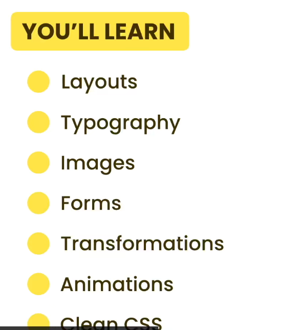

## Layout (94m)

### 1 - Introduction

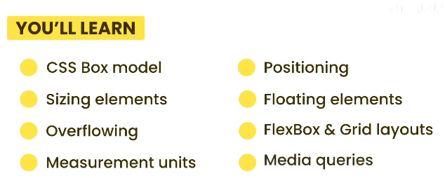

### 2 - The Box Model

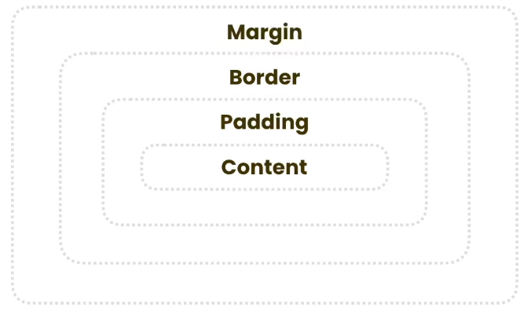

- use **margin**（外边距） 分隔不同元素
  - margin collapsing
- use **padding**（内边距） 增加内容与边框之间的空间

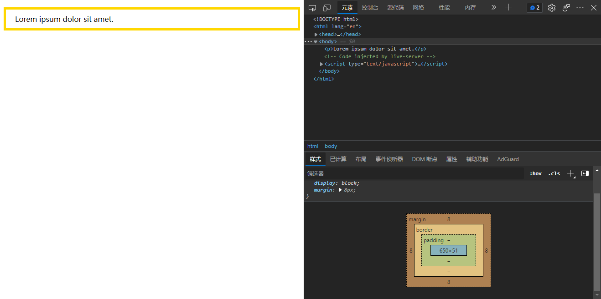

### 3 - Sizing Elements（改变元素大小）

- 默认情况下，宽&高是作用于内容区域的

  - padding & border会增加box的实际大小
  - margin对box大小无影响

- 可以通过`box-sizing: border-box`来设置宽&高的作用区域

  常见写法：全局选择器（注意伪元素选择器此规则不适用，须手动添加）

  ```css
  *, *::before, *::after {
  	box-sizing: border-box;
  }
  ```

- 宽&高属性只对块级元素有效

  - 对于行内元素要设置宽&高：

    ```css
    display: inline-block;
    ```

### 4 - Overflowing（溢出）

当元素是固定大小时，注意有可能发生溢出

- 用溢出属性解决

  ```
  overflow: hidden
  overflow: scroll
  overflow: auto
  ```

### 5 - Measurement Units（测量单位）


```css
.box {
    width: 15rem;
    height: 100vh;
    background-color: gold;
    border-top: 3px solid orange;   
}
```

该例子中：

- px：获得固定宽度的上边框
- vh：占满整个视域的高度
- rem：根据字符大小变化

### 6 - Positioning（定位）

- **相对定位** - 相对于原位置定位

原位置：

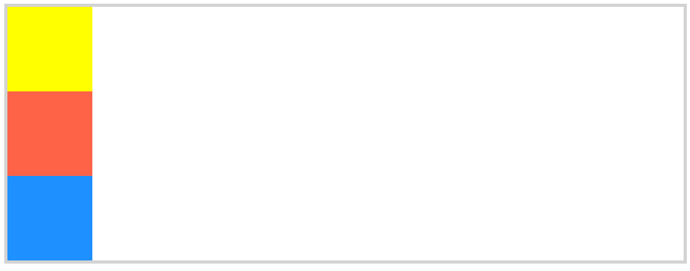

相对原位置移动（不会影响页面中的其他元素）：

```css
.box-two {
    background: tomato;
    position: relative;
    left: 4rem; /*元素左边增加5rem*/
    bottom: 2rem;
}
```


修改显示层级 - `z-index`（正值离眼睛近，负远）：

```css
.box-two {
    background: tomato;
    position: relative;
    left: 4rem; /*元素左边增加5rem*/
    bottom: 2rem; 
    z-index: -1;
}
```

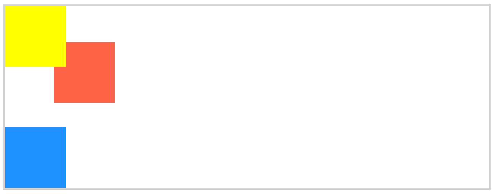

- **绝对定位** - 相对于该元素的容器元素定位
  - 当一个元素是绝对定位时，这个元素就从正常layout中去掉了，其他元素会当它不存在进行正常layout

需要在容器元素中，将容器的定位设为相对定位

```css
.boxes {
    border: 3px solid lightgrey;
    position: relative;
}

.box {
    width: 5rem;
    height: 5rem;
}

.box-one {
    background: yellow;
}
.box-two {
    background: tomato;
    position: absolute;
    right: 0;
    bottom: 0;
    z-index: -1;
}
.box-three {
    background: dodgerblue;
}
```

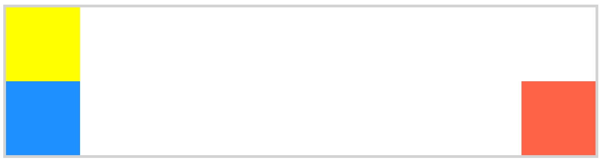

- 根据viewpoint（视域）定位
  - 如创建一个总显示在上面的导航栏

```css
.box-two {
    background: tomato;
    position: fixed;
    top: 0;
    z-index: 1;
}
```

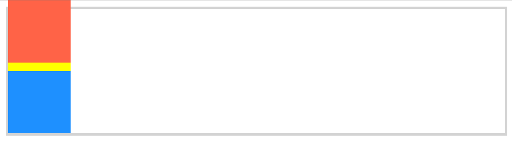

### 7 - Floating Elements

1. 左浮动

```html
<body>
    <article class="tweet">
        <div class="avatar">
        </div>
        <p>Lorem ipsum dolor sit amet.</p>
        <p>Lorem ipsum dolor sit amet consectetur adipisicing elit. Expedita odit tempora libero ducimus architecto
            ex magni ratione vero possimus itaque est corrupti debitis aliquid cumque voluptate provident quisquam
            atque dolore, error quos! Repudiandae quasi minus atque quas odio? Ab deserunt magnam dignissimos hic
            placeat ducimus unde ratione dicta eveniet fuga.</p>
    </article>
</body>
```

```css
.avatar {
    width: 5rem;
    height: 5rem;
    background-color: gold;
    float: left;  /* 在左侧浮动 */
    margin-right: 0.5rem;  /*文字远离box一些*/
}
```

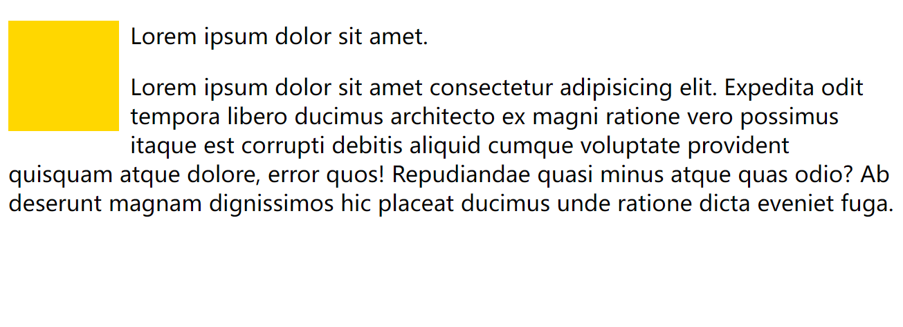

2. 清除部分浮动

第二个p标签增加`class="clear"`

```css
.clear {
    clear: both;
}
```

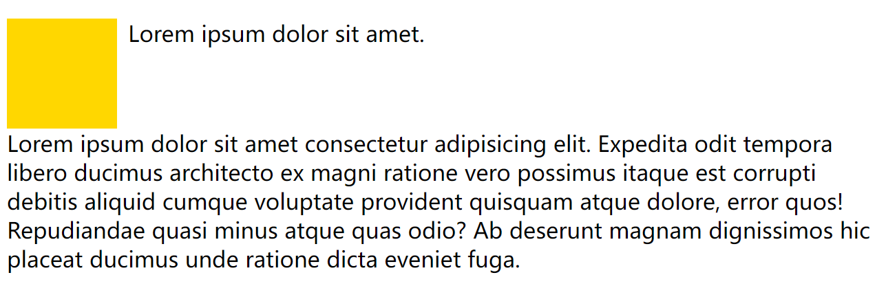

问题 - **parent collapsing**：父级元素看不到浮动元素

```html
<body>
    <article class="tweet">
        <div class="avatar">
        </div>
        <p>Lorem ipsum dolor sit amet.</p>
    </article>
</body>
```

```css
.avatar {
    width: 5rem;
    height: 5rem;
    background-color: gold;
    float: left;  /* 在左侧浮动 */
    margin-right: 0.5rem;  /*文字远离box一些*/
}

.tweet {
    border: 3px solid lightgrey;
}
```

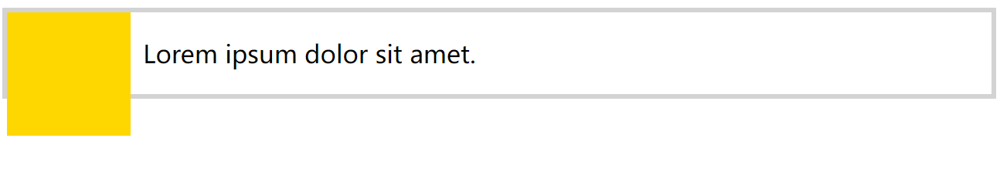

- 解决方法1

​	增加`<div class="clear"></div> `

```html
<body>
    <article class="tweet">
        <div class="avatar"></div>
        <p>Lorem ipsum dolor sit amet.</p>
        <div class="clear"></div>
    </article>
</body>
```

```css
.clear {
    clear: both
}
```

- 解决方法2

使用伪元素：

```html
<body>
    <article class="tweet clearfix">
        <div class="avatar"></div>
        <p>Lorem ipsum dolor sit amet.</p>
    </article>
</body>
```

```css
.clearfix::after {
    content: '';
    display: block;
    clear: both;
}
```

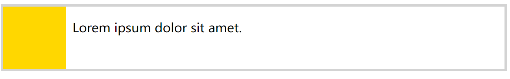

### 8 - FlexBox - Flexible Box Layout（弹性盒子）

一个游戏搞定：[Flexbox Froggy - A game for learning CSS flexbox](https://flexboxfroggy.com/)

- direction

Used for laying out elements in one direction（行or列）

```html
<body>
    <div class="container">
        <div class="box">A</div>
        <div class="box">B</div>
        <div class="box">C</div>
    </div>
</body>
```

```css
.container {
    border: 3px solid lightgrey;
    display: flex;
    flex-direction: column-reverse;
}

.box {
    width: 5rem;
    height: 5rem;
    background: gold;
    margin: 1rem;
}
```

flex-direction可选值：row(默认)、row-reverse、colomn、colomn-reverse

- alignment（对齐）

弹性盒子的坐标系：主轴(main)、正交轴(cross)（实际方向与弹性盒子方向有关）

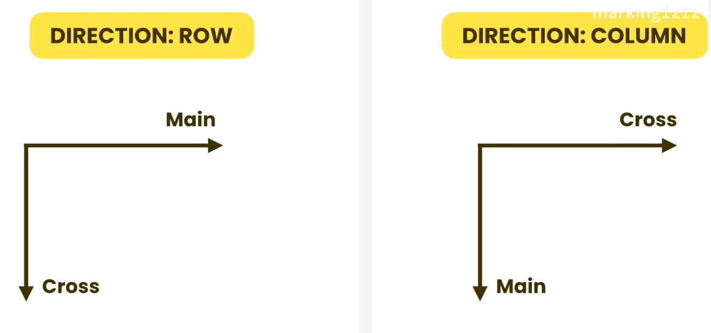

- 对齐元素
  - justify-content (along the **main** axis)
  - align-items (along the **cross** axis)

利用开发者工具进行调试：

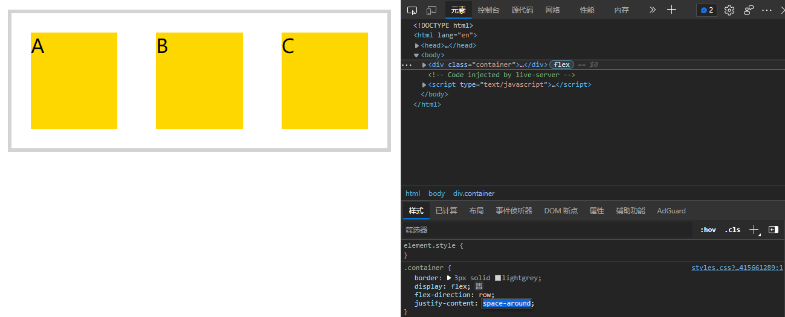


### 9 - Grid

一个游戏搞定：[Grid Garden - A game for learning CSS grid (codepip.com)](https://codepip.com/games/grid-garden/)

- 行和列一起排版

  - 常见场景：创建图片相册（4*3）

    

  - 网页排版（3*2）：

    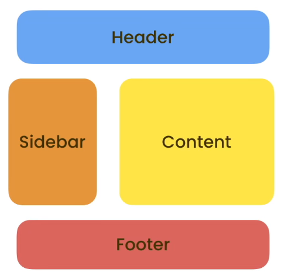


- define a Grid
  - `display: grid`
  - 设置网格的行数和列数：`grid-template-rows` `grid-template-columns`（px 百分比 fr）

- 合并单元格 (单元线 or span)
  - `grid-row`
  - `grid-column` 
  - `grid-area`
- 使用`order`属性重写某个网格项位置（网格项顺序）
  - 默认情况下，所有的网格项的`order`都是0，但是顺序也可以被任意设置为正数或者负数，就像`z-index`一样。
- 调节容器在单元格中的对齐方式
  - `justify-items` (along the horizontal axis)
  - `align-items` (along the vertical axis)

- 调节网格Grid在容器中的对齐属性
  - `justify-content`

### 10 - Hiding Elements

- `display: none` 
- `visibility: hidden`: 本应占据的位置没有让出（隐身）

### 11 - Media Queries

To provide different styles for different devices depending on their features.(如分辨率)

响应式网页（Responsive Web Site）- 根据不同介质做出调整


临界点设置

```css
@media screen and (min-width: 600px) {
	.container {
		flex-direction: row;
	}
}
```

## Typography (56m)

### 1 - Introduction

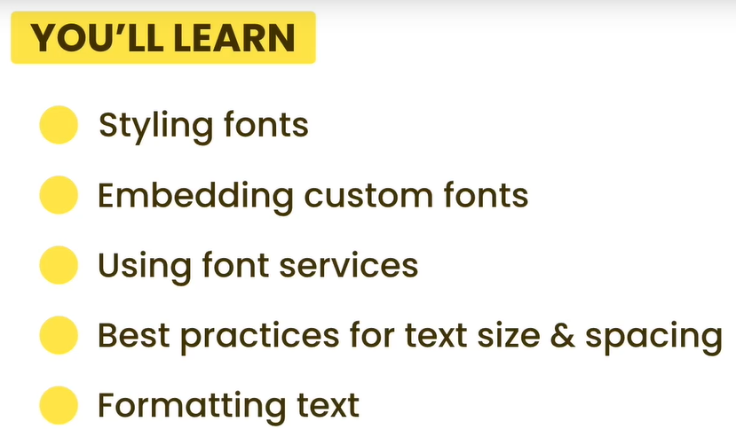

### 2 - Styling Fonts

三大类字体：

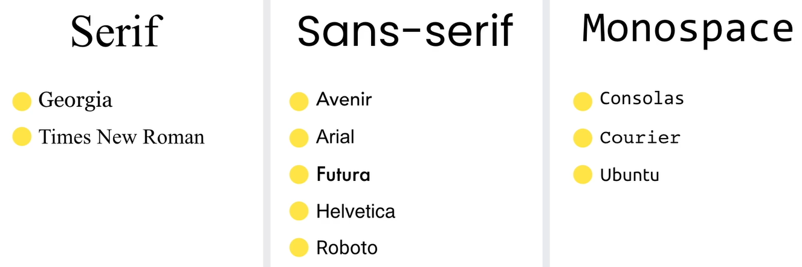

使用继承原则，在body中设置`font-family`

### 3 - Embedding Fonts（嵌入字体）

字体网站：

- [Font Squirrel | Free Fonts! Legit Free & Quality](https://www.fontsquirrel.com/)
- [Fonts.com | Find, Buy & Download Best Fonts](https://www.fonts.com/)
- [Fonts for Print, Products & Screens | MyFonts](https://www.myfonts.com/)

示例：opensans

```css
@font-face {
    font-family: 'opensans';
    src: url('fonts/open-sans/opensans-regular-webfont.woff2') format('woff2'),
         url('fonts/open-sans/opensans-regular-webfont.woff') format('woff');
    font-weight: normal;
    font-style: normal;
    font-display: fallback;
}

@font-face {
    font-family: 'opensans';
    src: url('fonts/open-sans/opensans-bold-webfont.woff2') format('woff2'),
         url('fonts/open-sans/opensans-bold-webfont.woff') format('woff');
    font-weight: bold;
    font-style: normal;
}
```

### 4 - Flash of Unstyled Text

如：

```css
font-display: fallback;
```

### 5 - Font Services

白嫖谷歌字体：Google Web Fonts ([fonts.google.com](https://fonts.google.com/))

使用说明：

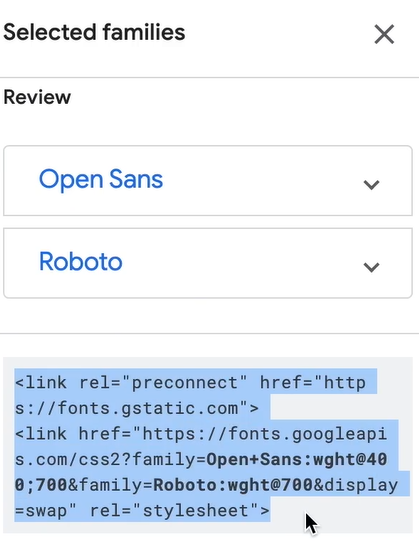

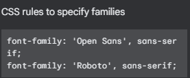

注：字体没有存储在我们的服务器上，没有包含在网站上

### 6 - System Font Stack

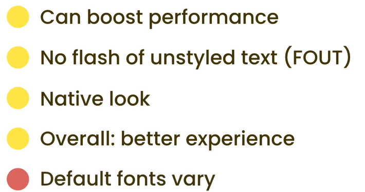

### 7 - Sizing Fonts

```css
font-size: 1rem;
```

注：单位rem (1 * font size of the root element-html)

标题大小设置： [type-scale.com](https://type-scale.com/)

### 8 - Vertical Spacing

- **margin**
- **line-height (行距)**

Law of Proximity: Objects that are closer are perceived to be related.

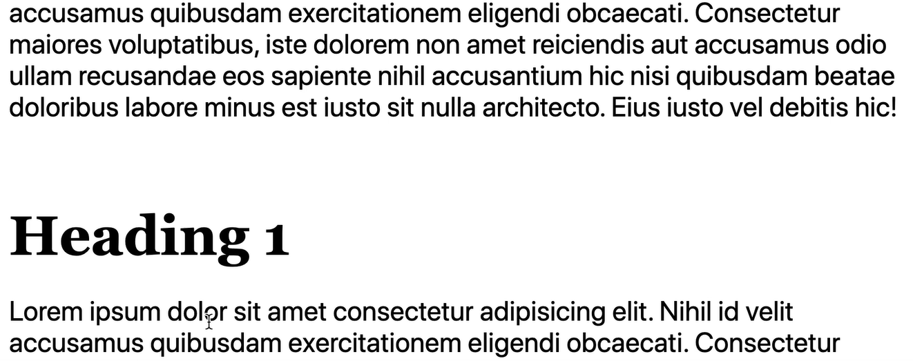

```css
h1 {
	margin: 3rem 0 1rem;
}
```

```css
font-size: 1rem;
line-height: 1.5;
```

### 9 - Horizontal Spacing 

- **letter-spacing（字符间距）**
- **word-spacing （词间距）**
- **width**

```css
letter-spacing: 1px;
word-spacing: 5px;
```

IDEAL LINE LENGTH: should be between 50-70 characters

```css
p {
	width: 50ch;
}
```

### 10 - Formatting Text

- text-align
- text-indent（缩进）
- text-decoration（如加下划线）
- text-transform（字符转化成大写或小写）
- white-space
- column-*
- direction

## Images (60m)

### 1 - Introduction

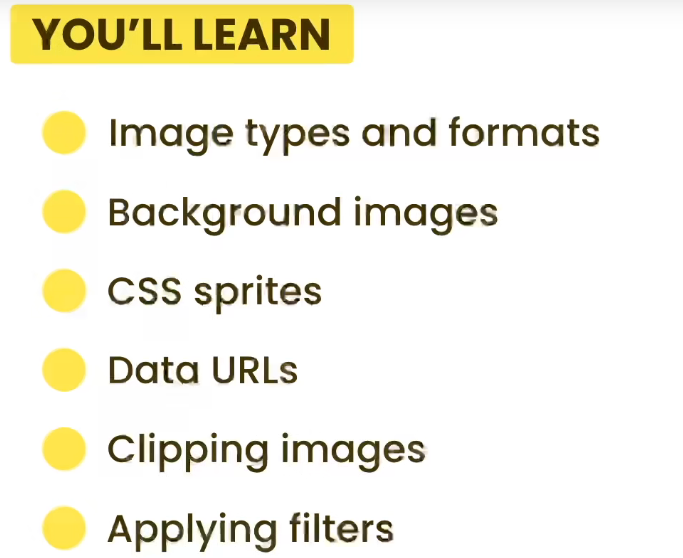

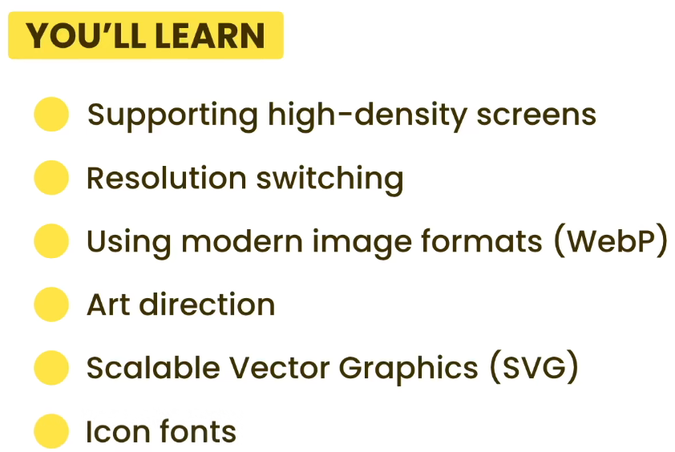

### 2 - Image Types and Formats

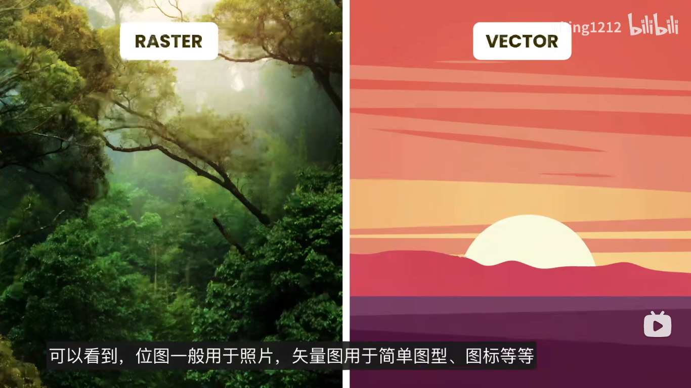

- 位图

  - 照片

    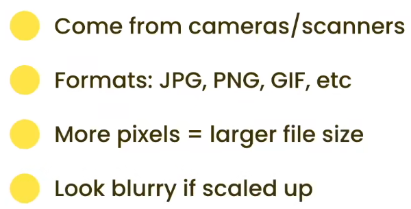

- 矢量图

  - 简单图形、图标

    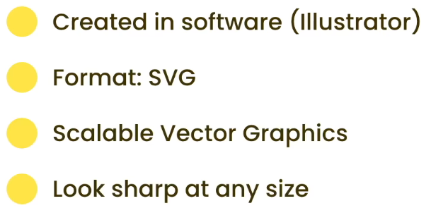

位图 & 矢量图对比：

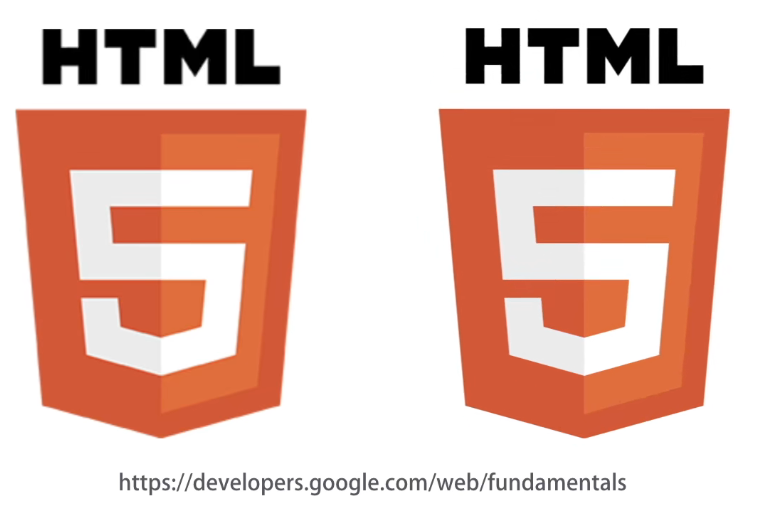

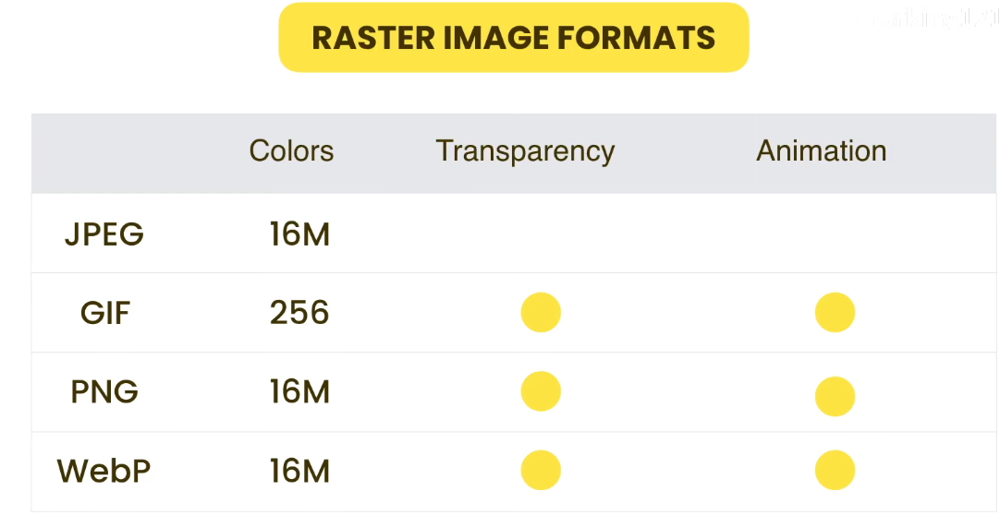

- icon网站：[Vector Icons and Stickers - PNG, SVG, EPS, PSD and CSS (flaticon.com)](https://www.flaticon.com/)

### 3 - Content Images

css拉伸位图会变模糊

### 4 - Background Images

```css
body {
    background: url(../images/bg-paper@2x.jpg);
    background-repeat: no-repeat;
    background-size: cover;
    height: 100vh;
}
```

### 5 - CSS Sprites

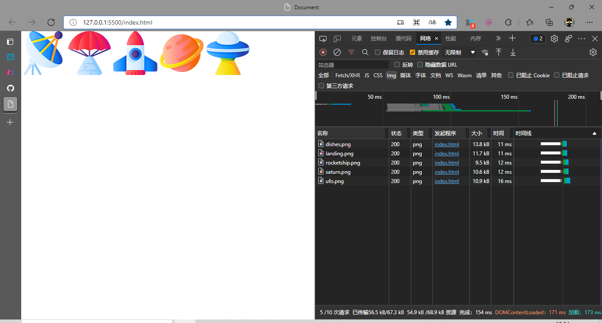

减少HTTP请求的优化技巧：将所有图片组合到一个图片中，这样只需向服务器请求一次图片

网站：[CSS Sprites Generator (toptal.com)](https://www.toptal.com/developers/css/sprite-generator)

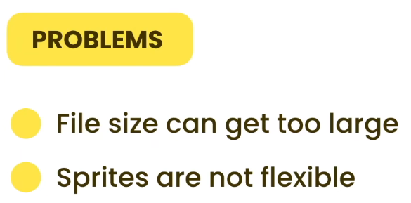

### 6 - Data URLs

另一种减少HTTP请求的优化技巧

Data URI Generator网站：[Data URI Generator - CSS Portal](https://www.cssportal.com/image-to-data/)

问题：

- Size of embedded code > size of the resource
- Increased complexity
- Slow on mobile

### 7 - Clipping（裁剪）

网站：[CSS Clip-Path Generator - CSS Portal](https://www.cssportal.com/css-clip-path-generator/)

### 8 - Filter（滤镜）

- greyscale
- blur
- contrast
- brightness
- saturate (饱和度)

### 9 - Supporting High-density Screens

### 10 - Resolution Switch

- [Responsive Image Breakpoints Generator by Cloudinary (responsivebreakpoints.com)](https://responsivebreakpoints.com/)

### 11 - Using Modern Image Format

conversion to webp:

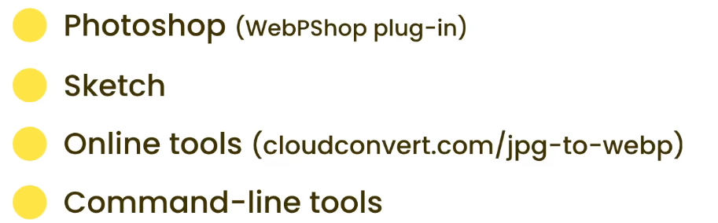

### 12 - Art Direction

- [earls.ca](https://earls.ca/)

### 13 - Scalable Vector Graphics

- [Customize and apply backgrounds fast | SVG Backgrounds](https://www.svgbackgrounds.com/)

### 14 - Font Icons

- [Font Awesome](https://fontawesome.com/)

## Forms

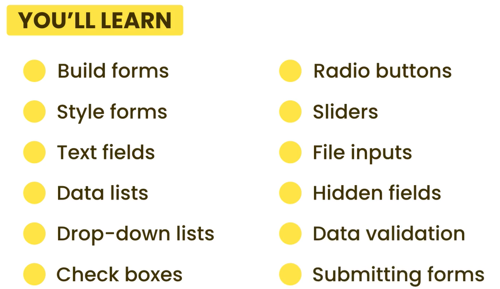