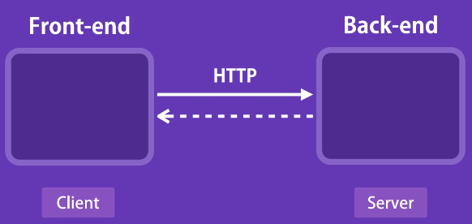

# React

- [视频链接](https://www.bilibili.com/video/BV1Sb411P79t?p=3&spm_id_from=pageDriver)

## 1- GettingStarted（28m）

### 1 - 创建开发环境

vs code插件：`Simple React Snippets` `prettier`

### 2 - 第一个React App

环境：Node >= 14.0.0 & npm >= 5.6

```bash
npx create-react-app react-app
```

zero-config setup:

- Development Server
- Webpack
- Babel

启动：

```bash
cd react-app
npm start
```

在本机的3000端口启动程序


### 3 - hello world

删除`src/`下所有文件，新建`index.js`

```javascript
import React from "react"
import ReactDOM from "react-dom"

const element = <h1>Hello World</h1>;
ReactDOM.render(element, document.getElementById("root"));
```

### 4 - 自定义配置

`package.json`

资深开发者：

```powershell
npm run eject
```

### 5 - 全栈架构（Full-stack Architecture）



### 6 - 课程大纲

- Js
- Components
- Tables
- Forms
- Routing
- HTTP Services
- Auth
- Deployment

## 2- ES6 Refresher（48m）

- var、let & const

  - `var`作用域为function

  - `let`、`const`作用域为定义它的代码块 ✔

- Objects：一组键值对

- `this`

  this的值取决于函数是怎样被调用的

  ```js
  const person = {
  	name: "Mosh",
  	walk() {
  		console.log(this);
  	}
  };
  
  person.walk();
  
  const walk = person.walk;
  walk();    // undefined
  ```

  - 使用对象形式调用方法：`this`**always returns a referrence to the current object**
  - 使用单独的函数or对象外的函数：`this` 返回全局对象(浏览器中是windows对象，严格模式则被设置为未定义)

-   绑定`this`

  - 目标：设置为无论何时，this都指向对象本身
  - js中函数也是对象

  ```javascript
  const walk = person.walk.bind(person);
  walk();    
  ```

- Arrow Functions

```javascript
const square = function(number) {
	return number * number;
}
const square = number => number * numer;
```

箭头函数有用的地方：

```javascript
// filter jobs, where job is active
const jobs = [
    { id: 1, isActive: true },
    { id: 2, isActive: true },
    { id: 3, isActive: false }
];

const activeJobs = jobs.filter(job => job.isActive);
console.log(activeJobs);
```

- Arrow Functions and this

箭头函数不会重新绑定`this`

```javascript
const person = {
	talk() {
		setTimeout(() => {
			console.log("this", this), 1000);
		}
	}
};
```

- Array.map()

  当要渲染列表时，要使用Array.map()

```javascript
const colors = ['red', 'green', 'blue'];
const items = colors.map(color => `<li>${color}</li>`);
```

- Object Destructuring

```javascript
const address = {
	street: '';
	city: '';
	country: ''
};

const { street, city, country } = address;
const { street: st } = address;
```

- Spread Operator
  - 合并数组、对象
  - 克隆数组、对象

```javascript
const first = [1, 2, 3];
const second = [4, 5, 6];
const combined = [...first, ...second];
const combined_a = [...first, 'a', ...second];

const first = { name: 'Mosh' };
const second = { job: 'Instructor' };
const combined = {...first, ...second, location: 'Australia'};
```

- Classes

```javascript
class Person {
	constructor(name) {
		this.name = name;
	}
	walk() {
		console.log("walk");
	}
}

const person = new Person("Lynn");
```

- Inheritance

```javascript
class Person {
	constructor(name) {
		this.name = name;
	}
	walk() {
		console.log("walk");
	}
}

class Teacher extends Person {
    constructor(name, degree) {
        super(name);
        this.degree = degree;
    }
    
	teach() {
		console.log("teach");
	}
}

const teacher = new Teacher("Mosh", "MSc");
```

- Modules
  - 模块化上一个应用——分成多个文件
  - 模块内定义的对象默认是私有的，需要导出，外部才可以访问

```javascript
export class Person {
	constructor(name) {
		this.name = name;
	}
	walk() {
		console.log("walk");
	}
}
```

```javascript
import { Person } from './person';

export class Teacher extends Person {
    constructor(name, degree) {
        super(name);
        this.degree = degree;
    }
    
	teach() {
		console.log("teach");
	}
}
```

```javascript
import { Teacher } from "./Teacher";

const teacher = new Teacher("Mosh", "MSc");
teacher.teach();
```

- Named and Default Exports
  - Named Exports: `import { ... } from ''` 
  - Default Exports: `import ... from ''`
  - 可以一起用，如`import React, { Component } from 'react';`