# React

- [视频链接](https://www.bilibili.com/video/BV1Sb411P79t?p=3&spm_id_from=pageDriver)

## 1- GettingStarted（28m）

### 1 - 创建开发环境

vs code插件：`Simple React Snippets` `prettier`

### 2 - 第一个React App

环境：Node >= 14.0.0 & npm >= 5.6

```bash
npx create-react-app react-app
```

zero-config setup:

- Development Server
- Webpack
- Babel

启动：

```bash
cd react-app
npm start
```

在本机的3000端口启动程序


### 3 - hello world

删除`src/`下所有文件，新建`index.js`

```javascript
import React from "react"
import ReactDOM from "react-dom"

const element = <h1>Hello World</h1>;
ReactDOM.render(element, document.getElementById("root"));
```

### 4 - 自定义配置

`package.json`

资深开发者：

```powershell
npm run eject
```

### 5 - 全栈架构（Full-stack Architecture）


### 6 - 课程大纲

- Js
- Components
- Tables
- Forms
- Routing
- HTTP Services
- Auth
- Deployment

## 2- ES6 Refresher（48m）

- var、let & const

  - `var`作用域为function

  - `let`、`const`作用域为定义它的代码块 ✔

- Objects：一组键值对

- `this`

  this的值取决于函数是怎样被调用的

  ```js
  const person = {
  	name: "Mosh",
  	walk() {
  		console.log(this);
  	}
  };
  
  person.walk();
  
  const walk = person.walk;
  walk();    // undefined
  ```

  - 使用对象形式调用方法：`this`**always returns a referrence to the current object**
  - 使用单独的函数or对象外的函数：`this` 返回全局对象(浏览器中是windows对象，严格模式则被设置为未定义)

-   绑定`this`

  - 目标：设置为无论何时，this都指向对象本身
  - js中函数也是对象

  ```javascript
  const walk = person.walk.bind(person);
  walk();    
  ```

- Arrow Functions

```javascript
const square = function(number) {
	return number * number;
}
const square = number => number * numer;
```

箭头函数有用的地方：

```javascript
// filter jobs, where job is active
const jobs = [
    { id: 1, isActive: true },
    { id: 2, isActive: true },
    { id: 3, isActive: false }
];

const activeJobs = jobs.filter(job => job.isActive);
console.log(activeJobs);
```

- Arrow Functions and this

箭头函数不会重新绑定`this`

```javascript
const person = {
	talk() {
		setTimeout(() => {
			console.log("this", this), 1000);
		}
	}
};
```

- Array.map()

  当要渲染列表时，要使用Array.map()

```javascript
const colors = ['red', 'green', 'blue'];
const items = colors.map(color => `<li>${color}</li>`);
```

- Object Destructuring

```javascript
const address = {
	street: '';
	city: '';
	country: ''
};

const { street, city, country } = address;
const { street: st } = address;
```

- Spread Operator
  - 合并数组、对象
  - 克隆数组、对象

```javascript
const first = [1, 2, 3];
const second = [4, 5, 6];
const combined = [...first, ...second];
const combined_a = [...first, 'a', ...second];

const first = { name: 'Mosh' };
const second = { job: 'Instructor' };
const combined = {...first, ...second, location: 'Australia'};
```

- Classes

```javascript
class Person {
	constructor(name) {
		this.name = name;
	}
	walk() {
		console.log("walk");
	}
}

const person = new Person("Lynn");
```

- Inheritance

```javascript
class Person {
	constructor(name) {
		this.name = name;
	}
	walk() {
		console.log("walk");
	}
}

class Teacher extends Person {
    constructor(name, degree) {
        super(name);
        this.degree = degree;
    }
    
	teach() {
		console.log("teach");
	}
}

const teacher = new Teacher("Mosh", "MSc");
```

- Modules
  - 模块化上一个应用——分成多个文件
  - 模块内定义的对象默认是私有的，需要导出，外部才可以访问

```javascript
export class Person {
	constructor(name) {
		this.name = name;
	}
	walk() {
		console.log("walk");
	}
}
```

```javascript
import { Person } from './person';

export class Teacher extends Person {
    constructor(name, degree) {
        super(name);
        this.degree = degree;
    }
    
	teach() {
		console.log("teach");
	}
}
```

```javascript
import { Teacher } from "./Teacher";

const teacher = new Teacher("Mosh", "MSc");
teacher.teach();
```

- Named and Default Exports
  - Named Exports: `import { ... } from ''` 
  - Default Exports: `import ... from ''`
  - 可以一起用，如`import React, { Component } from 'react';`

## 3- Components（组件）

### 1 - Introduction

本章目标：


### 2 - Setting Up the Project

```powershell
npx create-react-app counter-app
```

1.  安装bootstrap

```
npm i bootstrap@4.1.1
```

2. 在index.js中引入：

```javascript
import 'bootstrap/dist/css/bootstrap.css'
```

### 3 - 第一个React组件

在`src`下创建文件夹`components`，增加新文件`counter.jsx`

```jsx
import React, { Component } from 'react';

class Counter extends Component {
    render() {
        return <h1>Hello World</h1>;
    }
}

export default Counter;
```

在`index.js`中导入`Counter`类，修改render对象为`Counter`

### 4 - Specifying Children

```jsx
class Counter extends Component {
    render() {
        return <div><h1>Hello World</h1><button>Increment</button></div>;
    }
}
```

or

```jsx
class Counter extends Component {
    render() {
        return <React.Fragment><h1>Hello World</h1><button>Increment</button></React.Fragment>;
    }
}
```

### 5 - Embedding Expressions（嵌入表达式）

不硬编码，动态显示值

`state`包含这个组件所需的数据

```jsx
class Counter extends Component {
    state = {
        count: 1
    };

    render() {
        return <React.Fragment><span>{this.state.count}</span><button>Increment</button></React.Fragment>;
    }
}
```

jsx表达式就像js对象一样

```jsx
class Counter extends Component {
    state = {
        count: 0
    };

    render() {
        return <React.Fragment><span>{this.formatCount()}</span><button>Increment</button></React.Fragment>;
    }

    formatCount() {
        const { count } = this.state;
        return count === 0 ? "Zero" : count;
    }
}
```

### 6 - Setting Attributes

给元素设置属性

```jsx
styles = {
    fontSize: 5,
    fontWeight: "bold",
  };

  render() {
    return (
      <div>
        <span style={this.styles} className="badge badge-primary m-2">
          {this.formatCount()}
        </span>
        <button className="btn btn-secondary btn-sm">Increment</button>
      </div>
    );
  }
```

### 7 - Rendering Classes Dynamically

```jsx
import React, { Component } from "react";

class Counter extends Component {
  state = {
    count: 0,
  };

  render() {
    return (
      <div>
        <span className={this.getBadgeClasses()}>{this.formatCount()}</span>
        <button className="btn btn-secondary btn-sm">Increment</button>
      </div>
    );
  }

  getBadgeClasses() {
    let classes = "badge m-2 badge-";
    classes += this.state.count === 0 ? "warning" : "primary";
    return classes;
  }

  formatCount() {
    const { count } = this.state;
    return count === 0 ? <span>Zero</span> : count;
  }
}

export default Counter;
```

### 8 - Rendering Lists

学习如何渲染一个列表

```jsx
class Counter extends Component {
  state = {
    count: 0,
    tags: ["tag1", "tag2", "tag3"],
  };

  render() {
    return (
      <div>
        <span className={this.getBadgeClasses()}>{this.formatCount()}</span>
        <button className="btn btn-secondary btn-sm">Increment</button>
        <ul>
          {this.state.tags.map((tag) => (
            <li id={tag}>{tag}</li>
          ))}
        </ul>
      </div>
    );
  }
}
```

### 9 - Conditional Rendering

目标：如果数组列表至少有一个项就渲染，如果没有就输出“没有任何标签”

- jsx中没有if语句，因此要回到js层面

方式一：

```jsx
class Counter extends Component {
  state = {
    count: 0,
    tags: [],
  };

  renderTags() {
    if (this.state.tags.length === 0) return <p>there is no tags!</p>;

    return (
      <ul>
        {this.state.tags.map((tag) => (
          <li id={tag}>{tag}</li>
        ))}
      </ul>
    );
  }

  render() {
    return <div>{this.renderTags()}</div>;
  }
}
```

方式二：

- js不同于其他语言，逻辑符号&&可以连接非布尔值（js类真值、类假值）

```jsx
render() {
    return (
      <div>{this.state.tags.length === 0 && <p>please create a tag</p>}</div>
    );
  }
```

### 10 - Handling Events

- 所有react元素都有基于dom事件的属性，如button有onClick属性

```jsx
import React, { Component } from "react";

class Counter extends Component {
  state = {
    count: 0,
  };

  handleIncrement() {
    console.log("Increment Clicked");
  }

  render() {
    return (
      <div>
        <span className={this.getBadgeClasses()}>{this.formatCount()}</span>
        <button
          onClick={this.handleIncrement}
          className="btn btn-secondary btn-sm"
        >
          Increment
        </button>
      </div>
    );
  }

  getBadgeClasses() {
    let classes = "badge m-2 badge-";
    classes += this.state.count === 0 ? "warning" : "primary";
    return classes;
  }

  formatCount() {
    const { count } = this.state;
    return count === 0 ? <span>Zero</span> : count;
  }
}

export default Counter;
```

handleIncrement()函数内部无法访问this（未定义）

obj.method()和function()中this的区别

### 11 - Binding Events Handlers

解决方法一（手动绑定）：js对象有bind方法，返回该对象的新实例，可以设置this指向counter对象

```jsx
class Counter extends Component {
  state = {
    count: 0,
  };

  constructor() {
    super();
    this.handleIncrement = this.handleIncrement.bind(this);
  }

  handleIncrement() {
    console.log("Increment Clicked", this);
  }

  render() {
    return (
      <div>
        <span className={this.getBadgeClasses()}>{this.formatCount()}</span>
        <button
          onClick={this.handleIncrement}
          className="btn btn-secondary btn-sm"
        >
          Increment
        </button>
      </div>
    );
  }
```

点击按钮，成功输出counter对象

解决方法二：箭头函数（不会重新绑定this，而是继承this）

```jsx
handleIncrement = () => {
    console.log("Increment Clicked", this);
};
```

### 12 - Updating the State

- setState()

```jsx
handleIncrement = () => {
    this.setState({ count: this.state.count + 1 });
};
```

### 13 - What Happens When State Changes

### 14 - Passing Event Arguments

箭头函数

```jsx
handleIncrement = (product) => {
    console.log("product:", product);
    this.setState({ count: this.state.count + 1 });
  };

<button
          onClick={() => this.handleIncrement(product)}
          className="btn btn-secondary btn-sm"
        >
          Increment
        </button>
```

### 15 - Setting Up the Vidly Project

```powershell
npx create-react-app vidly
```

安装两个库：`Bootstrap` `font awesome`

```powershell
cd vidly
npm i bootstrap@4.1.1 font-awesome@4.7.0
npm start
```

访问[getbootstrap.com](https://getbootstrap.com/)，在Examples目录找一个简单的模板，打开Framework-Starter template，查看网页源代码，注意body标签的部分

### 16 - Exercises

目标：


### 17 - Building the Movies Component

index.js加上：

```javascript
import "bootstrap/dist/css/bootstrap.css";
import "font-awesome/css/font-awesome.css";
```

App.js：

```javascript
import React, { Component } from "react";
import "./App.css";
import Movies from "./components/movie";

class App extends Component {
  render() {
    return (
      <main className="container">
        <Movies />
      </main>
    );
  }
}

export default App;
```

movie.jsx：

```jsx
import React, { Component } from "react";
import { getMovies } from "../services/fakeMovieService";

class Movies extends Component {
  state = {
    movies: getMovies(),
  };

  handleDelete = (movie) => {};

  render() {
    return (
      <table className="table">
        <thead>
          <tr>
            <th>Title</th>
            <th>Genre</th>
            <th>Stock</th>
            <th>Rate</th>
          </tr>
        </thead>
        <tbody>
          {this.state.movies.map((movie) => (
            <tr>
              <td>{movie.title}</td>
              <td>{movie.genre.name}</td>
              <td>{movie.numberInStock}</td>
              <td>{movie.dailyRentalRate}</td>
            </tr>
          ))}
        </tbody>
      </table>
    );
  }
}

export default Movies;
```

效果：


### 18 - Deleting a Movie

 movies.jsx：

```jsx
import React, { Component } from "react";
import { getMovies, deleteMovie } from "../services/fakeMovieService";

class Movies extends Component {
  state = {
    movies: getMovies(),
  };

  handleDelete = (movie) => {
    const movies = this.state.movies.filter((m) => m._id !== movie._id);
    this.setState({ movies });
  };

  render() {
    return (
      <table className="table">
        <thead>
          <tr>
            <th>Title</th>
            <th>Genre</th>
            <th>Stock</th>
            <th>Rate</th>
            <th></th>
          </tr>
        </thead>
        <tbody>
          {this.state.movies.map((movie) => (
            <tr key={movie._id}>
              <td>{movie.title}</td>
              <td>{movie.genre.name}</td>
              <td>{movie.numberInStock}</td>
              <td>{movie.dailyRentalRate}</td>
              <td>
                <button
                  onClick={() => this.handleDelete(movie)}
                  className="btn btn-danger btn-sm"
                >
                  Delete
                </button>
              </td>
            </tr>
          ))}
        </tbody>
      </table>
    );
  }
}

export default Movies;
```

### 19 - Conditional Rendering

 movies.jsx：

```jsx
import React, { Component } from "react";
import { getMovies } from "../services/fakeMovieService";

class Movies extends Component {
  state = {
    movies: getMovies(),
  };

  handleDelete = (movie) => {
    const movies = this.state.movies.filter((m) => m._id !== movie._id);
    this.setState({ movies });
  };

  render() {
    const { length: count } = this.state.movies;

    if (count === 0) return <p>There is no movies in the database.</p>;

    return (
      <React.Fragment>
        <p>Showing {count} movies in the database.</p>
        <table className="table">
          <thead>
            <tr>
              <th>Title</th>
              <th>Genre</th>
              <th>Stock</th>
              <th>Rate</th>
              <th></th>
            </tr>
          </thead>
          <tbody>
            {this.state.movies.map((movie) => (
              <tr key={movie._id}>
                <td>{movie.title}</td>
                <td>{movie.genre.name}</td>
                <td>{movie.numberInStock}</td>
                <td>{movie.dailyRentalRate}</td>
                <td>
                  <button
                    onClick={() => this.handleDelete(movie)}
                    className="btn btn-danger btn-sm"
                  >
                    Delete
                  </button>
                </td>
              </tr>
            ))}
          </tbody>
        </table>
      </React.Fragment>
    );
  }
}

export default Movies;
```

index.css加上：

```css
padding: 20px 0 0 0;
```

效果：


## 4- Composing Components（01:19）

### 1 - Introduction

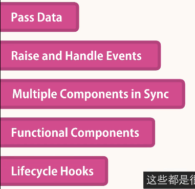

### 2 - Composing Components

项目`counter-app`

counters.jsx:

```jsx
import React, { Component } from "react";
import Counter from "./counter";

class Counters extends Component {
  state = {
    counters: [
      { id: 1, value: 0 },
      { id: 2, value: 0 },
      { id: 3, value: 0 },
      { id: 4, value: 0 },
    ],
  };
  render() {
    return (
      <div>
        {this.state.counters.map((counter) => (
          <Counter key={counter.id}></Counter>
        ))}
      </div>
    );
  }
}

export default Counters;
```

### 3 - Passing Data to Components

- props属性

counters.jsx:

```jsx
render() {
    return (
      <div>
        {this.state.counters.map((counter) => (
          <Counter key={counter.id} value={counter.value} selected={true} />
        ))}
      </div>
    );
  }
```

counter.jsx:

```jsx
state = {
    value: this.props.value,
  };
```

### 4 - Passing Children

- children是props的一个属性，开闭标签之间的是children

counters.jsx

```jsx
<Counter key={counter.id} value={counter.value} selected={true}>
            <h4>Title #{counter.id}</h4>
          </Counter>
```

### 5 - Debugging React Apps

- 工具：chrome插件-React Developer Tools

$r

### 6 - Prop vs State

区别：

- props: include data that **input** to the component（只读的）
- state: include data that are local or private to the component（其他组件不能访问这个组件的state，只能在组件内被访问）

### 7 - Raising and Handling Events

counter中添加删除按钮

- The components that **owns** a piece of the state, should be the one **modifying** it.

counter组件发起一个事件onDelete，父组件Counters处理这个事件handleDelete()

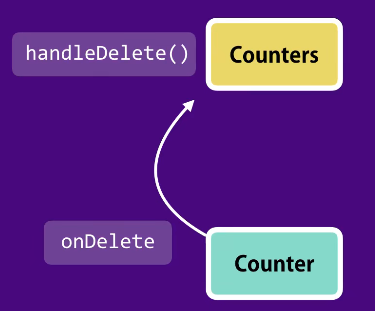

counters.jsx添加：

```jsx
handleDelete = () => {
    console.log("Delete handler called");
  };
```

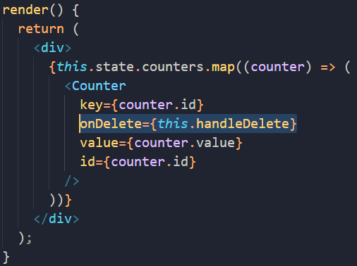

counter.jsx添加：

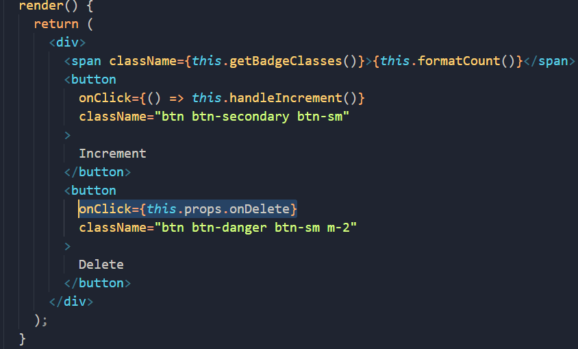

### 8 - Updating the State

counter.jsx:

```jsx
import React, { Component } from "react";

class Counter extends Component {
  state = {
    value: this.props.counter.value,
  };

  handleIncrement = () => {
    this.setState({ value: this.state.value + 1 });
  };

  render() {
    return (
      <div>
        <span className={this.getBadgeClasses()}>{this.formatCount()}</span>
        <button
          onClick={() => this.handleIncrement()}
          className="btn btn-secondary btn-sm"
        >
          Increment
        </button>
        <button
          onClick={() => this.props.onDelete(this.props.counter.id)}
          className="btn btn-danger btn-sm m-2"
        >
          Delete
        </button>
      </div>
    );
  }

  getBadgeClasses() {
    let classes = "badge m-2 badge-";
    classes += this.state.value === 0 ? "warning" : "primary";
    return classes;
  }

  formatCount() {
    const { value: count } = this.state;
    return count === 0 ? <span>Zero</span> : count;
  }
}

export default Counter;
```

counters.jsx:

```jsx
import React, { Component } from "react";
import Counter from "./counter";

class Counters extends Component {
  state = {
    counters: [
      { id: 1, value: 4 },
      { id: 2, value: 0 },
      { id: 3, value: 0 },
      { id: 4, value: 0 },
    ],
  };

  handleDelete = (counterID) => {
    console.log("handleDelete called", counterID);
    const counters = this.state.counters.filter((m) => m.id !== counterID);
    this.setState({ counters });
  };

  render() {
    return (
      <div>
        {this.state.counters.map((counter) => (
          <Counter
            key={counter.id}
            onDelete={this.handleDelete}
            counter={counter}
          />
        ))}
      </div>
    );
  }
}

export default Counters;
```

### 9 - Single Source od Truth

每个组件都有自己的state,counters组件有一个counter对象数组，counter组件有一个value,这个value值没有和counters里面的保持一致（`value: this.props.counter.value`，这句代码只在counter组件被实例化的时候调用了一次）

解决：删掉counter组件中的本地state，建立唯一数据源

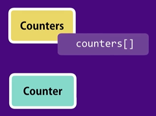

### 10 - Removing the Local State

- 被控组件（controlled component）: 没有自己的本地state，所有数据来自props（完全被父组件控制）

  - **use props to display data & notify changes**

  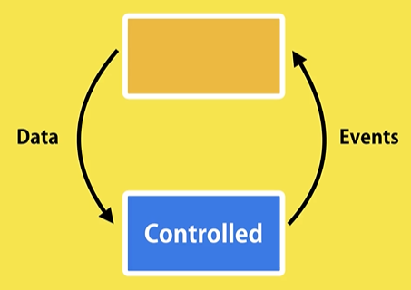

counter.jsx:

删除state，替换所有this.state

```jsx
import React, { Component } from "react";

class Counter extends Component {
  render() {
    return (
      <div>
        <span className={this.getBadgeClasses()}>{this.formatCount()}</span>
        <button
          onClick={() => this.props.onIncrement(this.props.counter)}
          className="btn btn-secondary btn-sm"
        >
          Increment
        </button>
        <button
          onClick={() => this.props.onDelete(this.props.counter.id)}
          className="btn btn-danger btn-sm m-2"
        >
          Delete
        </button>
      </div>
    );
  }

  getBadgeClasses() {
    let classes = "badge m-2 badge-";
    classes += this.props.counter.value === 0 ? "warning" : "primary";
    return classes;
  }

  formatCount() {
    const { value } = this.props.counter;
    return value === 0 ? "Zero" : value;
  }
}

export default Counter;
```

counters.jsx:

```jsx
import React, { Component } from "react";
import Counter from "./counter";

class Counters extends Component {
  state = {
    counters: [
      { id: 1, value: 4 },
      { id: 2, value: 0 },
      { id: 3, value: 0 },
      { id: 4, value: 0 },
    ],
  };

  handleReset = () => {
    const counters = this.state.counters.map((c) => {
      c.value = 0;
      return c;
    });
    this.setState({ counters });
  };

  handleIncrement = (counter) => {
    const counters = [...this.state.counters];
    const index = counters.indexOf(counter);
    counters[index].value++;
    this.setState({ counters });
  };

  handleDelete = (counterID) => {
    const counters = this.state.counters.filter((m) => m.id !== counterID);
    this.setState({ counters });
  };

  render() {
    return (
      <div>
        <button onClick={this.handleReset} className="btn btn-primary m-2">
          Reset
        </button>
        {this.state.counters.map((counter) => (
          <Counter
            key={counter.id}
            onDelete={this.handleDelete}
            onIncrement={this.handleIncrement}
            counter={counter}
          />
        ))}
      </div>
    );
  }
}

export default Counters;
```

### 11 - Multiple Components in Sync

增加导航栏

原来组件结构：

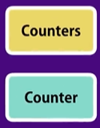

修改组件结构：

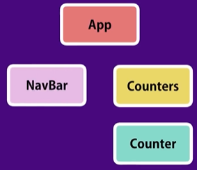

index.js将root组件修改回`App`:

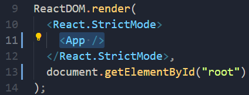

App.js中用一个基本的bootstrap模板替代默认模板：

[Navbar-bootstrap资源](https://getbootstrap.com/docs/5.1/components/navbar/)

navbar.jsx加上：

```jsx
<nav class="navbar navbar-light bg-light">
        <a class="navbar-brand" href="#">
          Navbar
        </a>
      </nav>
```

如何在导航栏Navbar显示counter的数量？

- 当两个组件是上下层的关系时可以共享、同步数据
- 此处Counters、Navbar非上下层关系
- 两个组件没有上下父子级别的关系时想要共享、同步数据 => 数据上移

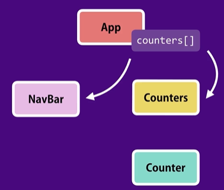

### 12 - Lifting the State Up

1. 将state和操作state的所有方法移动到App组件中

2. Counters的props对象中设置Event-`onReset`、`onDelete`、`onIncrement`; 
   1. 在Counters组件中不处理事件，而是将事件冒泡给父组件App

3. counters[]数据源修改 
4. 在导航栏显示总计数

App.js:

```jsx
import React, { Component } from "react";
import "./App.css";
import Navbar from "./components/navbar";
import Counters from "./components/counters";

class App extends Component {
  state = {
    counters: [
      { id: 1, value: 4 },
      { id: 2, value: 0 },
      { id: 3, value: 0 },
      { id: 4, value: 0 },
    ],
  };

  handleReset = () => {
    const counters = this.state.counters.map((c) => {
      c.value = 0;
      return c;
    });
    this.setState({ counters });
  };

  handleIncrement = (counter) => {
    const counters = [...this.state.counters];
    const index = counters.indexOf(counter);
    counters[index].value++;
    this.setState({ counters });
  };

  handleDelete = (counterID) => {
    const counters = this.state.counters.filter((m) => m.id !== counterID);
    this.setState({ counters });
  };

  render() {
    return (
      <React.Fragment>
        <Navbar
          totalCounters={this.state.counters.filter((c) => c.value > 0).length}
        />
        <main className="container">
          <Counters
            counters={this.state.counters}
            onReset={this.handleReset}
            onIncrement={this.handleIncrement}
            onDelete={this.handleDelete}
          />
        </main>
      </React.Fragment>
    );
  }
}

export default App;
```

counters.jsx:

```jsx
import React, { Component } from "react";
import Counter from "./counter";

class Counters extends Component {
  render() {
    return (
      <div>
        <button onClick={this.props.onReset} className="btn btn-primary m-2">
          Reset
        </button>
        {this.props.counters.map((counter) => (
          <Counter
            key={counter.id}
            onDelete={this.props.onDelete}
            onIncrement={this.props.onIncrement}
            counter={counter}
          />
        ))}
      </div>
    );
  }
}

export default Counters;
```

navbar.jsx:

```jsx
import React, { Component } from "react";

class Navbar extends Component {
  state = {};
  render() {
    return (
      <nav class="navbar navbar-light bg-light">
        <a class="navbar-brand" href="#">
          Navbar
          <span className="badge badge-pill badge-secondary">
            {this.props.totalCounters}
          </span>
        </a>
      </nav>
    );
  }
}

export default Navbar;
```

### 13 - Stateless Functional Components

- 像组件Navbar，只有一个返回函数render()，也没有state，只从props获取数据
- 可以将这类组件转换为Stateless Functional Components（不使用类定义这个组件，而使用函数）

快捷键：sfc

```jsx
const Navbar = (props) => {
  return (
    <nav class="navbar navbar-light bg-light">
      <a class="navbar-brand" href="#">
        Navbar
        <span className="badge badge-pill badge-secondary">
          {props.totalCounters}
        </span>
      </a>
    </nav>
  );
};
```

### 14 - Destructuring Arguments

```jsx
const { onReset, counters, onIncrement, onDelete } = this.props;
```

------

### 15 - Lifecycle Hooks

一些可以加入到组件的特殊方法（Lifecycle Hooks），react会自动在不同阶段调用这些方法 

组件在生命周期经历的阶段：

1. MOUNT - 创建组件示例并插入到DOM


2. UPDATE - 组件的state或props改变时发生


3. UNMOUNT - 组件被从DOM中移出，如删除


### 16 - Mounting Phase

1. constructor: 仅在实例化的时候调用一次，常用于将props中的外部数据赋给state

```jsx
constructor(props) {
	super(props);
    console.log("App - Constructor");
	this.state = props.something;
}
```

2. render
3. componentDidMount: 这个钩子在组件被加入DOM后调用，perfect place to make AJAX called to get data from the server

### 17 - Updating Phase

1. render

2. componentDidUpdate - 组件被更新后调用（常用于当有变化时，通过AJAX请求重新向服务器请求数据）

   ```jsx
   componentDidUpdate(preProps, prevState) {
   	console.log('preProps', preProps);
   	console.log('prevState', prevState);
       if(preProps.counter.value != this.props.counter.value) 	{
           // Ajax call and get new data from the server
   	}
   }
   ```

### 18 - Unmounting Phase

componentWillUnmount - 组件被移除之前做一些清理工作，如计时器、监听器、内存优化

```jsx
componentWillUnmount() {
	console.log("counter - Unmount")
}
```

------

### 19 - Excercise - Decrement Button

[Bootstrap-Gridlayout](https://getbootstrap.com/docs/5.1/layout/grid/#example)

### 20 - Solution - Decrement Button

### 21 - Exercise - Like Component

vidly

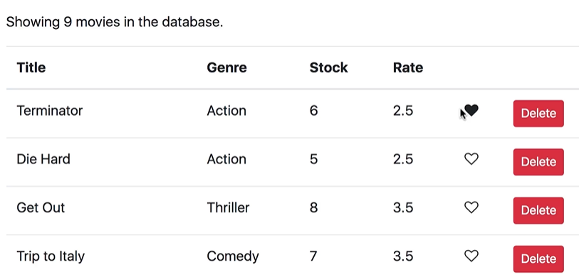

### 22 - Solution - Like Component

- [fa-heart-o: Font Awesome Icons](https://fontawesome.com/v4/icon/heart-o)
- [fa-heart: Font Awesome Icons](https://fontawesome.com/v4/icon/heart)

在components下创建文件夹common，用来存储所有可复用的组件

like.jsx

- Input: liked: boolean
- Output: onClick

```jsx
import React, { Component } from "react";

const Like = (props) => {
  let classes = "fa fa-heart";
  if (!props.liked) classes += "-o";
  return (
    <i
      onClick={props.onClick}
      style={{ cursor: "pointer" }}
      className={classes}
      aria-hidden="true"
    ></i>
  );
};

export default Like;
```

movies.jsx:

```jsx
import React, { Component } from "react";
import { getMovies } from "../services/fakeMovieService";
import Like from "./common/like";

class Movies extends Component {
  state = {
    movies: getMovies(),
  };

  handleDelete = (movie) => {
    const movies = this.state.movies.filter((m) => m._id !== movie._id);
    this.setState({ movies });
  };

  handleLike = (movie) => {
    const movies = [...this.state.movies];
    const index = movies.indexOf(movie);
    movies[index] = { ...movies[index] };
    movies[index].liked = !movies[index].liked;
    this.setState({ movies });
  };

  render() {
    const { length: count } = this.state.movies;

    if (count === 0) return <p>There is no movies in the database.</p>;

    return (
      <React.Fragment>
        <p>Showing {count} movies in the database.</p>
        <table className="table">
          <thead>
            <tr>
              <th>Title</th>
              <th>Genre</th>
              <th>Stock</th>
              <th>Rate</th>
              <th />
              <th />
            </tr>
          </thead>
          <tbody>
            {this.state.movies.map((movie) => (
              <tr key={movie._id}>
                <td>{movie.title}</td>
                <td>{movie.genre.name}</td>
                <td>{movie.numberInStock}</td>
                <td>{movie.dailyRentalRate}</td>
                <td>
                  <Like
                    liked={movie.liked}
                    onClick={() => this.handleLike(movie)}
                  />
                </td>
                <td>
                  <button
                    onClick={() => this.handleDelete(movie)}
                    className="btn btn-danger btn-sm"
                  >
                    Delete
                  </button>
                </td>
              </tr>
            ))}
          </tbody>
        </table>
      </React.Fragment>
    );
  }
}

export default Movies;
```

效果图：

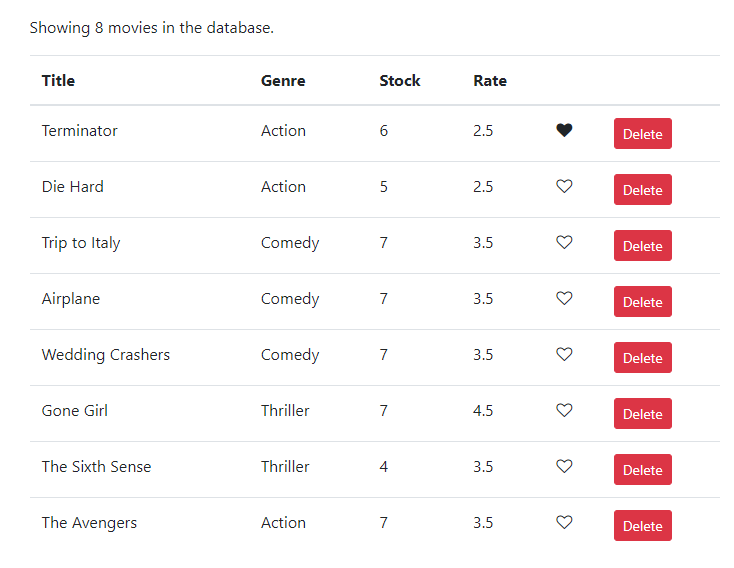

