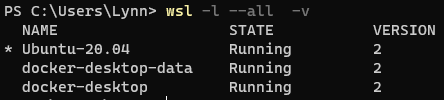
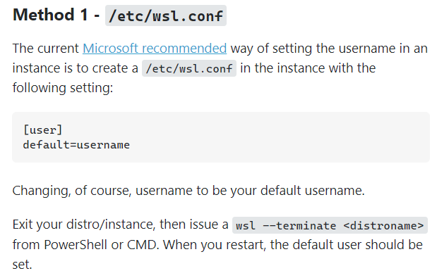

# WSL2配置

## 从C盘迁移到非系统盘

1. 查看所有分发版本

```powershell
wsl -l --all  -v
```



2. 导出分发版为tar文件到f盘

```powershell
wsl --export Ubuntu-20.04 f:\wsl2\ubuntu20.04.tar

wsl --export docker-desktop f:\wsl2\docker\docker-desktop.tar

wsl --export docker-desktop-data f:\wsl2\docker\docker-desktop-data.tar
```

3. 注销当前分发版

```powershell
wsl --unregister docker-desktop

wsl --unregister docker-desktop-data
```

4. 重新导入并安装分发版

```powershell
wsl --import Ubuntu20.04 f:\wsl2\ubuntu f:\wsl2\ubuntu20.04.tar --version 2

wsl --import docker-desktop f:\wsl2\docker\docker-desktop f:\wsl2\docker\docker-desktop.tar --version 2

wsl --import docker-desktop-data f:\wsl2\docker\docker-desktop-data f:\wsl2\docker\docker-desktop-data.tar --version 2
```

5. 设置该版本为默认版本

```powershell
wsl --set-default Ubuntu20.04
```

6. [默认用户为root, 修改默认用户为lynn(首先确定有这个用户)](https://superuser.com/questions/1566022/how-to-set-default-user-for-manually-installed-wsl-distro)



## Ubuntu-WSL linux换源

1. 备份源列表文件

```bash
cd /etc/apt/
sudo cp sources.list sources.list.bak
```

2. 修改源列表文件

```bash
sudo vim sources.list
```

3. 更新软件列表

```bash
sudo apt-get update
sudo apt-get upgrade
```

## 设置proxy

- [使用环境变量设置proxy](https://www.webservertalk.com/configure-proxy-on-ubuntu#:~:text=You%20can%20setup%20the%20proxy%20in%20Ubuntu%20Desktop,on%20Apply%20system%20wide%20to%20apply%20the%20changes.)

通过修改`~/.bashrc`文件为单个用户设置永久代理

1. 打开~/.bashrc

```bash
code ~/.bashrc
```

2. 添加

```.bashrc
# proxy config
export windows_host=`cat /etc/resolv.conf|grep nameserver|awk '{print $2}'`
export ALL_PROXY=http://$windows_host:<proxy-port>
export HTTP_PROXY=$ALL_PROXY
export http_proxy=$ALL_PROXY
export HTTPS_PROXY=$ALL_PROXY
export https_proxy=$ALL_PROXY

if [ "`git config --global --get proxy.https`" != "http://$windows_host:<proxy-port>" ]; then
            git config --global proxy.https http://$windows_host:<proxy-port>
fi
```

3. 使该生效配置

```bash
source ~/.bashrc
```

